# Preliminari

## Celle di codice

```{r setup, include=FALSE}
## Iniziamo con alcuni settaggi.
# NB. Il tag `include = FALSE` "prevents code and results from appearing in the finished file. R Markdown still runs
# the code in the chunk, and the results can be used by other chunks.
# Per sicurezza e pulizia cancelliamo tutte le variabili di ambiente in memoria (esiti di esecuzioni precedenti dello script).
knitr::opts_chunk$set(echo = TRUE)
# setwd("C:/Users/Utente/Desktop/salvataggi/SALVATAGGIO DATI/Documents/Seminari/Data Science (corsi)/Corso Python ed R")
```

## Inserire una cella di codice

Come inserire una nuova cella di codice.<br> In tre modi:

-   premendo la combinazione di caratteri: ctrl+alt+I
-   scrivendo tre backtick con alt+96 seguiti da alt+123 per le due parentesi
    graffe
-   copia e incolla di una cella esitente

```{r}

```

## Pulizie e caricamenti

```{r pulizia}
rm(list=ls()) # cancellazione dalla memoria di tutte le varibili del global environment (per pulizia)
library(ISLR) # contiene il dataset Credit (il dataframe usato per gli esempi)
head(Credit)
options(max.print = 50)
Credit
```

## Opzioni chunk

```{r immagine0, echo=FALSE, out.width="50%", fig.cap="A nice image."}
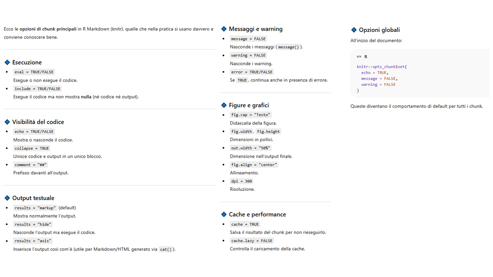
```

## Copilot

Perchè l'icona rossa *Copilot: Not signed in*?<br> ❌ Non è un errore R

❌ Non è legato al chunk R Markdown

❌ Non è legato a attach(Credit)

✅ È solo lo stato del plugin Copilot

Come risolvere.Se vuoi usare Copilot: - Clicca su Copilot: Not signed in - Segui
la procedura di login con GitHub - Autorizza l’IDE

Se invece non ti interessa usarlo, puoi: - Ignorarlo (non influisce su nulla) -
Oppure **disabilitare il plugin da `Tools` → `Global Options` → `Copilot`**

# Lo scenario della Data Science

```{r immagine1, echo=FALSE, out.width="50%", fig.cap="A nice image."}
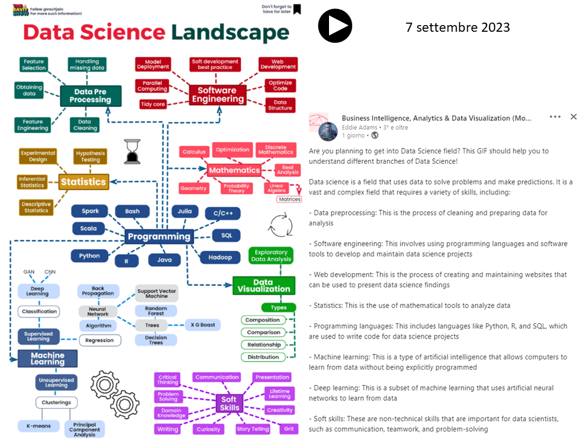
```

```{r immagine2, echo=FALSE, out.width="50%", fig.cap="A nice image."}
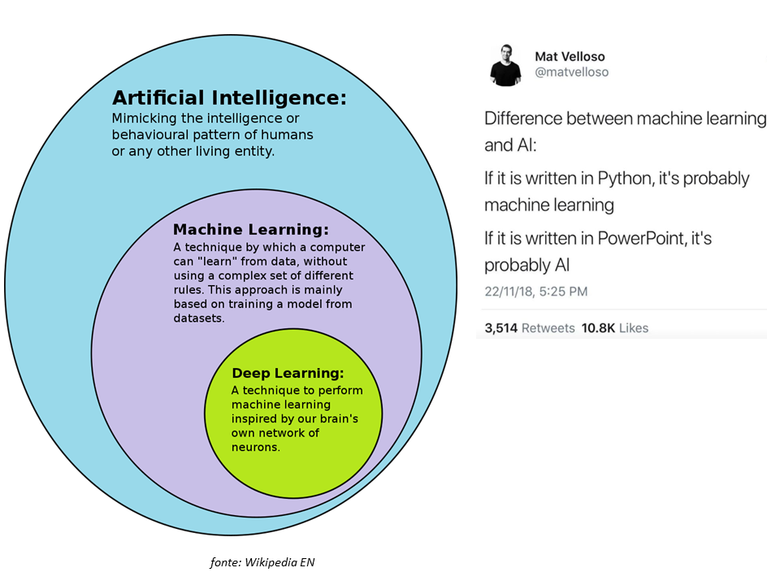
```

```{r immagine3, echo=FALSE, out.width="50%", fig.cap="A nice image."}

```

# Mini introduzione ad R

## Caratteristiche

-   origini: università di Auckland (New Zealand) a fine anni '90, derivato da S
    di John Chambers del 1976 nei Bells Labs.

-   diffusione nel ML (il primo, testa a testa, con Python): molti siti (Quick R
    e libri (Robert Kabacoff, Hadley Wickham, etc), riviste (R Journal),"the R
    development core team", contributi world-wide (CRAN), siti documentativi
    (R-bloggers, Quick-R, Inside-R), siti Q&A (stackoverflow, R-devel).

-   nel ML, R equivalente a Python; come RO, rapporto 10:1; meno
    package/funzione nella AI

-   "provides the WIDEST variety of statistical (linear and nonlinear modelling,
    classical statistical tests, time-series analysis, classification,
    clustering, ...) and graphical techniques (base e ggplot)" - dal sito R.

-   NEW methods on a WEEKLY basis.

-   completamente open-source, veramente gratuito (i concorrenti costano da
    migliaia e decine di migliaia di euro);

-   interpretato, weak typed, scritto in C e R stesso (facile da comprendere,
    perciò).

-   piattaforme supportate: funziona su Windows, Mac, Linux, Unix, Ubuntu, etc.
    funziona da web: url \<- "<https://rdrr.io/snippets/>" browseURL(url,
    browser = getOption("browser")) url \<-
    "<https://cran.r-project.org/web/views/WebTechnologies.html>" browseURL(url,
    browser = getOption("browser"))

-   Shiny is an R package that makes it easy to build interactive web apps
    straight from R. \# c'è persino una versione per iPhone (sconsigliabile).

-   ha if, cicli e funzioni, ovviamente.

-   tutti gli "oggetti" sono in memoria durante l'esecuzione di una sessione.

-   molto estensibile: immensa comunità di utenti R (molto attiva) --\> CRAN
    (23,000+ package al 2026). Con `install_packages()`.

-   aggancia codice C++ (rcpp) e Fortran (compilato) per velocizzare operazioni
    matematiche.

-   ha funzioni di debug e profiling.

-   supporta le operazioni matriciali (e quindi l'algebra lineare - importante
    nel ML).

-   connettività a 360°(Oracle, Access, DB2, .txt, .xlsx, .csv, .json, SAP, SAS)

-   può utilizzare SQL/ODBC ed accedere ai principali database, inclusi Oracle
    ed IBM (e ovviamente excel e file di testo).

-   può accedere a Hadoop (file system distribuito) e Spark cache engine (big
    data).

-   AWS SageMaker (il ML di AWS)

-   Microsoft Azure AI platform

-   IBM da qualche anno offre "massively parallel in-database analytics in R"
    nei suoi prodotti. Idem per Microsoft (support esteso per R)

-   ha un suo dialetto ('tidyverse') per "functionality to model, transform, and
    visualize data".

-   RMarkdown ("the Latex-like documentation system for R") per produrre
    documenti HTML con codice R, URL, immagini, video, PDF, Word.

-   breve cfr. con altri linguaggi di Data Science / Machine Learning:
    Python/scikit-learn, Matlab/Octave, Orange, Excel.

```{r assegnazione}
a =  "pippo"
a
```

## OOP (Object Oriented Programming)

```{r immagine4, echo=FALSE, out.width="50%", fig.cap="A nice image."}
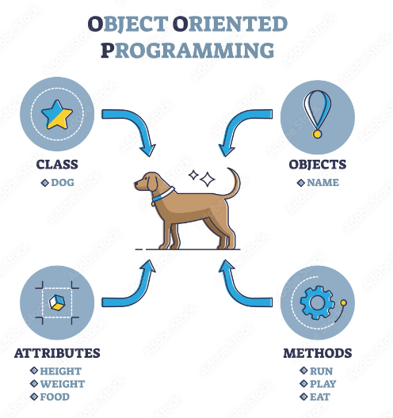
```

```{r immagine5, echo=FALSE, out.width="50%", fig.cap="A nice image."}
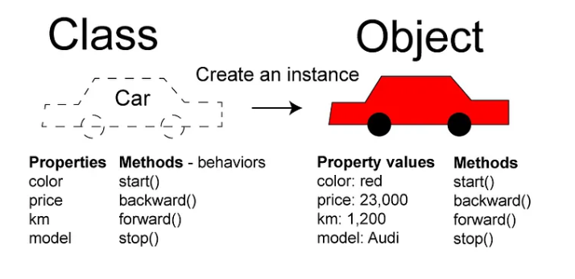
```

```{r immagine6, echo=FALSE, out.width="50%", fig.cap="A nice image."}
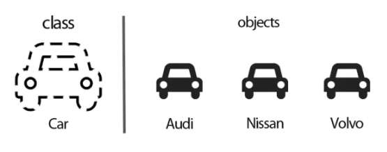
```

```{r immagine7, echo=FALSE, out.width="50%", fig.cap="A nice image."}
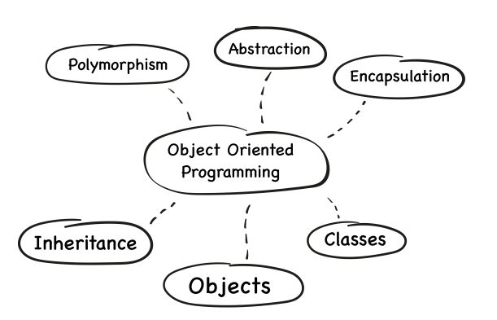
```

```{r immagine8, echo=FALSE, out.width="50%", fig.cap="A nice image."}
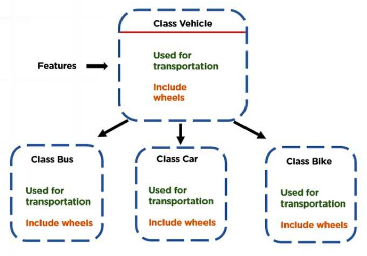
```

```{r immagine9, echo=FALSE, out.width="50%", fig.cap="A nice image."}
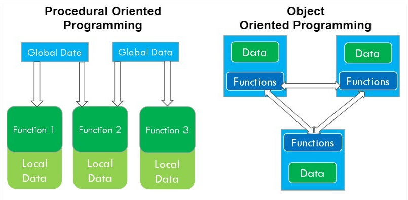
```

## OOP in R

-   "generally in DS/ML functional programming is much more important than
    object-oriented programming, because you typically solve complex problems by
    decomposing them into simple functions, not simple objects
    [<https://adv-r.hadley.nz/oo.html>]; comunque, in R ci sono parecchi
    (troppi?) OOP systems;
-   gli OOP di R più usati sono:
    1.  S3 e S4 (come S3 ma più formale e rigoroso), che fanno parte entrambe di
        R base ed implementano la"generic-function OOP, aka functional OOP"
        (diversa da quella di Java o C++, perchè le chiamate ai metodi sembrano
        chiamate di funzione); ad es. i metodi 'print', 'plot', 'summary' o
        'predict' dei vari oggetti sono metodi S3;
    2.  le Reference Classes (RC) ed R6 (che è molto simile alle RC), che
        implementano la "message-passing (encapsuleted) OOP" (che è il paradigma
        OOP tradizionale usato negli altri linguaggi OO) [le prime fanno parte
        di R base, R6 invece del package R6];
-   i "base types", interni ad R (e scritti in C), che sono la base degli altri
    sistemi OOP prima visti; vedi "Advanced R" di Wickham, pp. 99 e ss.
-   Attenzione: in R, qualsiasi cosa che può essere assegnata ad una variabile è
    un "oggetto": costanti, strutture dati, funzioni, grafici. [non sono
    "oggetti" in senso stretto] - RIA 2nd ed. p. 22
-   cheatsheet (fatti bene) su R,RStudio, RMarkdown ed altro

## Limiti di R

-   R base è meno veloce di Python e Matlab (su grandi dataset), in particolare
    nei cicli 'for', ma R avanzato (ad es. pacchetti specifici per big data) può
    lavorare con GBs/TBs! (ad es. RIA, 2nd ed. Appendix F);

-   in generale, R e Python sono meno veloci di C++, Fortran, .Net, Java, ABAP

-   il data typing di R è a volte poco chiaro e poco coerente;

-   manca a volte un "disegno" unico (al 2026 CRAN ha 23.000 pacchetti di autori
    diversi); è l'inevitabile prezzo da pagare ad una comunità molto viva.

-   R, come python, è mondo molto ampio e complesso (curva di apprendimento
    lunga per raggiungere alti obiettivi): è linguaggio + ML!

-   **inferiore a python nella AI e come ecosistema**

## Perchè R?

Perchè usare un linguaggio specifico di ML anzichè un linguaggio generico
(general-purpose), come Java, C#, ABAP, ecc?<br>. 3 ragioni principali:

-   disponibilità di TUTTI gli algoritmi di ML oggi e domani disponibili (grazie
    al CRAN);
-   caricamento e gestione di dataset esterni molto facilitata; in particolare,
    R e python hanno il "funzionamento vettoriale";
-   eccellente data visualization (grafici interattivi, modificabili, ecc)

## Libri

-   base/intermedio: "R in Action" (RIA) di Robert Kabacoff, 3rd edition, 2022;
-   avanzato: "Advanced R" di Hadley Wickham (2014); 2nd edition 2019.
-   umoristico, ma utile: "How to lie with Statistics" di Darrell Huff (1954) -
    ITALIANO

## R vs Python

```{r immagine9bis, echo=FALSE, out.width="50%", fig.cap="A nice image."}

```

```{r immagine10, echo=FALSE, out.width="50%", fig.cap="A nice image."}
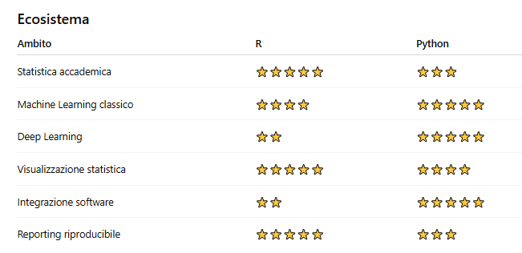
```

```{r immagine11, echo=FALSE, out.width="50%", fig.cap="A nice image."}
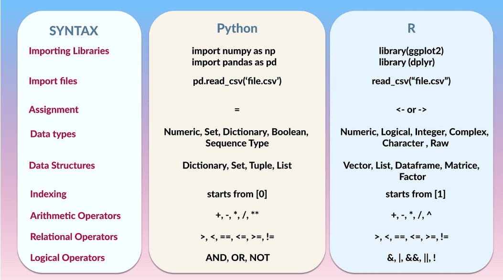
```

# Tipi di dati

-   tipi di dati **elementari** (*atomici*)

-   **strutture dati**: scalari (0 dim) vs vettoriali (1 dim) vs array (2+ dim,
    aka "tensori")

Una sinossi:

```{r immagine12, echo=FALSE, out.width="50%", fig.cap="A nice image."}
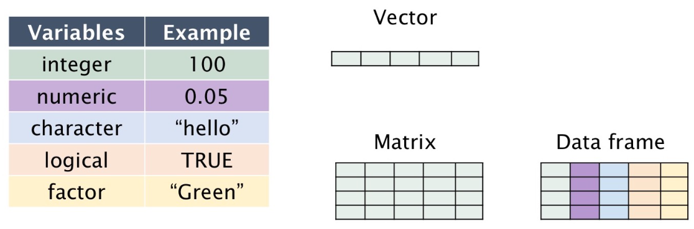
```

Nell'elenco dei dati atomici (elementari) di sinistra manca il tipo dati
"data/ora".<br>

**"mode" (typeof) vs "class"**.

```{r classe OO}
# scalari:
a <- 100
mode(a)
typeof(a)

b <-  0.05
mode(b)
typeof(b)

c <- "hello"
mode(c)
typeof(c)
class(c)

d <- TRUE
mode(d)
typeof(d)
class(d)

# vettori:
vet <- c(1,2,3,4)
mode(vet)
typeof(vet)
class(vet)

# dataframe:
first_column <- c("value_1", "value_2", "value_3")
second_column <- c("value_A", "value_B", "value_C")

df <- data.frame(first_column, second_column)
df

# oppure:

df <- data.frame(first_column = c("value_1", "value_2", "value_3"),
                 second_column = c("value_A", "value_B", "value_C")
                 )

df

Name <- c("John", "Bill", "Maria", "Ben", "Tina")
Age <- c(23, 41, 32, 58, 26)

df <- data.frame(Name, Age)
df
```

Un'importantissima distinzione nei dati elementari è tra dati **quantitativi**,
cioè numerici, e dati **qualitativi**, cioè categorici.<br>

```{r immagine13, echo=FALSE, out.width="50%", fig.cap="A nice image."}
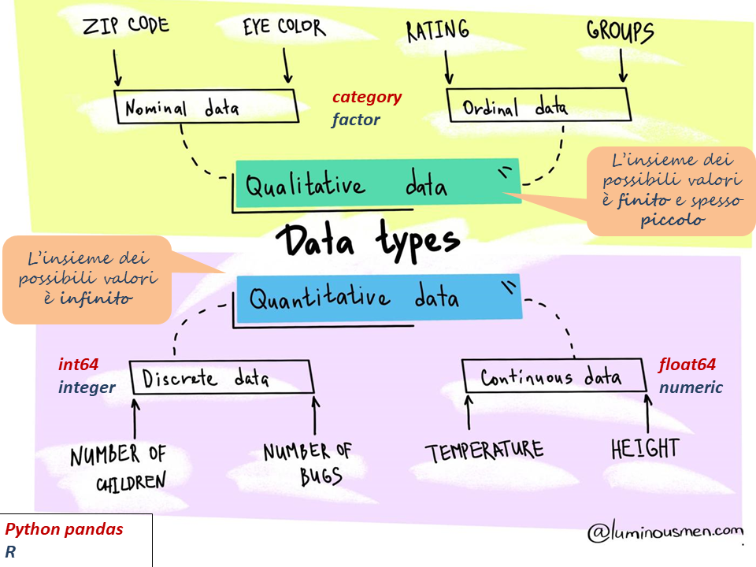
```

**Le array**

```{r array}
# array:

# create two 2 by 3 matrix
array1 <- array(c(1:12), dim = c(2,3,2))
print(array1)


vector1 =  c (5, 10, 15,20)
vector2 =  c (25, 30, 35, 40, 45, 50,55,60)
array2 = array (c (vector1, vector2),dim =c(4,4,3))
print(array2)
```

La funzione `dim`:

```{r immagine14, echo=FALSE, out.width="50%", fig.cap="A nice image."}
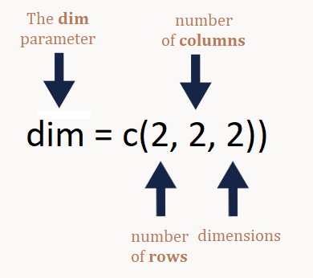
```

```{r immagine, echo=FALSE, out.width="50%", fig.cap="A nice image."}
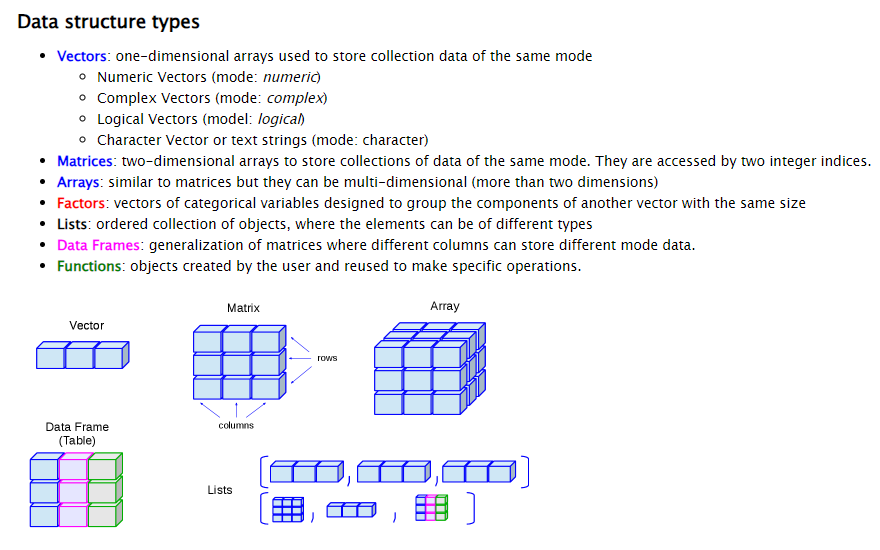
```

## Liste

```{r liste}
mia.lista <- list(
  numero = 10,
  testo = "ciao",
  vettore = c(1, 2, 3),
  matrice = matrix(1:4, nrow = 2)
)
mia.lista
```

## Fattori

```{r fattori}
sesso <- factor(c("M", "F", "F", "M", "M"))
sesso
```

R: - memorizza internamente 1, 2 - associa le etichette "F", "M" - ordina
automaticamente i livelli in ordine alfabetico

Livelli espliciti del fattore: possono essere definiti così:

```{r livelli_espliciti}
sesso <- factor(c("M", "F", "F", "M"),
                levels = c("M", "F"))
levels(sesso)
```

Questo è importante nei modelli statistici, perché il primo livello è il
riferimento.

Fattore ordinato: se le categorie hanno un ordine naturale (es. basso, medio,
alto):

```{r livelli_ordinati}
livello <- factor(c("basso", "alto", "medio"),
                  levels = c("basso", "medio", "alto"),
                  ordered = TRUE)

livello
```

Qui R sa che: *basso \< medio \< alto*<br> e puoi fare confronti:

``` r
livello[1] < livello[3]
```

Se guardiamo la struttura di `sesso`:

```{r struttura_fattore}
str(sesso)
```

Cioè: - è un vettore di interi - con attributo `levels`

Uso classico dei fattori in un modello statistico classico:

```{r esempio_fattore_in_modelli}
dati <- data.frame(
  gruppo = factor(c("A","B","A","B")),
  valore = c(10, 15, 12, 18)
)

mod <- lm(valore ~ gruppo, data = dati)
summary(mod)
```

R crea automaticamente le dummy variables dal fattore.

Da [questo](http://venus.ifca.unican.es/Rintro/dataStruct.html) ottimo sito.

# Conversione di dati elementari

```{r conversione}

# numerical or logical to character 
age <- 20 
pwd <- FALSE
as.character(age) 
as.character(pwd)

# character or logical to numeric 
age <- "20"
pwd <- FALSE
as.numeric(age) 
as.numeric(pwd)

# vectors to matrix
vector1 <- c('red','green',"blue","yellow") 
vector2 <- c(1,2,3,4) 
print("Row Major Order") 
rbind(vector1,vector2) 
print("Column Major Order") 
cbind(vector1,vector2) 


# vectors to dataframe
vector1 <- c('red', 'green', "blue", "yellow") 
vector2 <- c(1, 2, 3, 4) 
data.frame(vector1, vector2)
```

# Tipi di dati strutturati

## I vettori

```{r}
vet <- c(10,20,50,28)
vet
vet[1]
length(vet)
```
## Le array

```{r immagine17bis, echo=FALSE, out.width="50%", fig.cap="A nice image."}
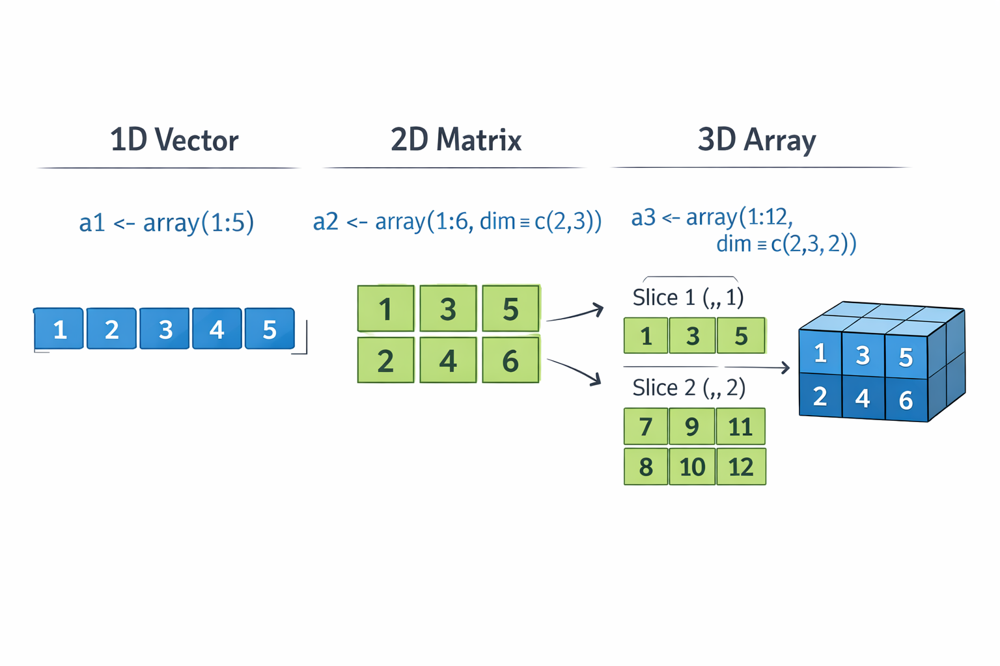
```

## I dataframe

```{r immagine17, echo=FALSE, out.width="50%", fig.cap="A nice image."}
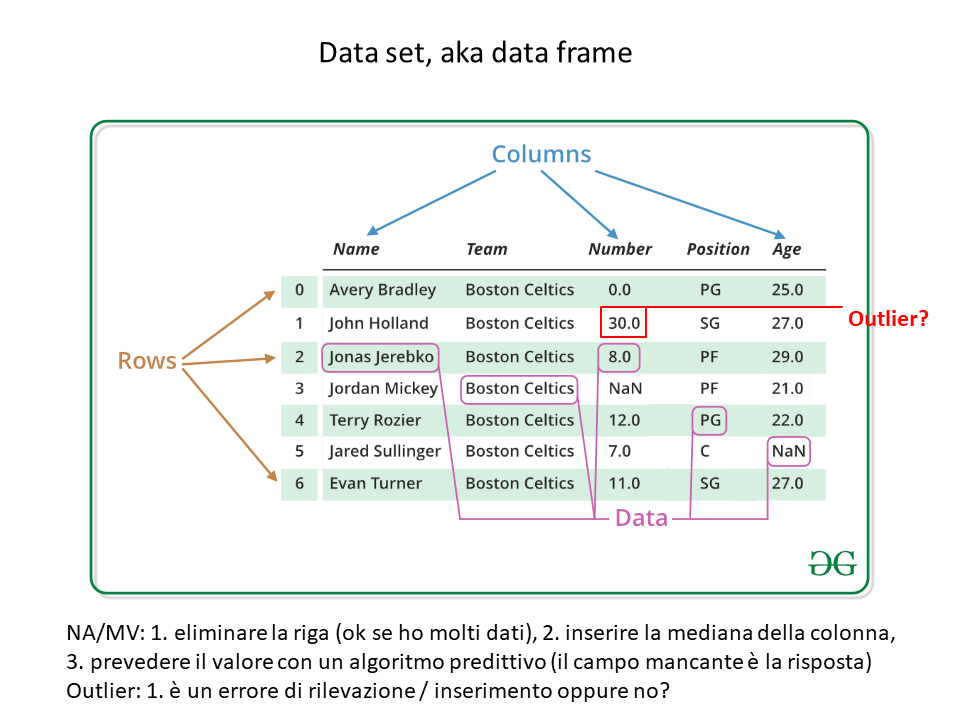
```

```{r immagine18, echo=FALSE, out.width="50%", fig.cap="A nice image."}
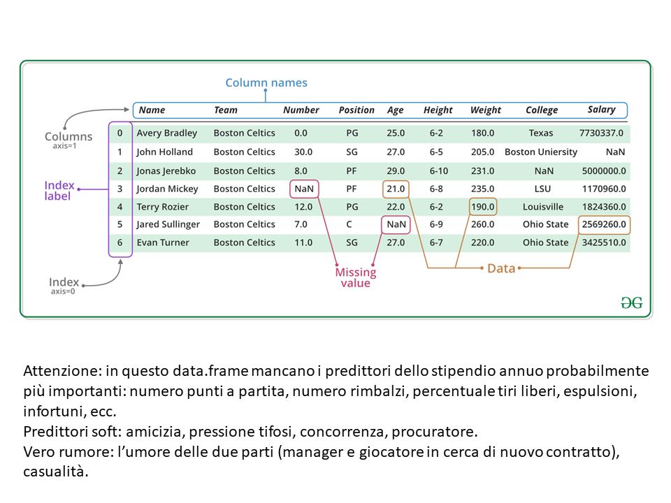
```
# I package

```{r immagine14bis, echo=FALSE, out.width="50%", fig.cap="A nice image."}
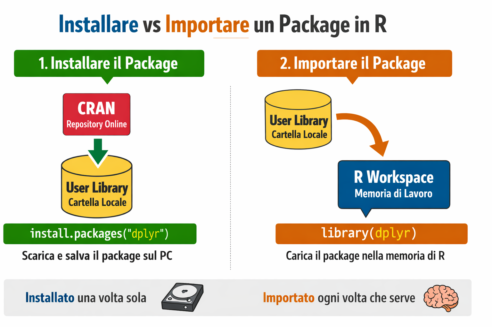
```

# Analisi esplorativa dei dati

```{r immagine15, echo=FALSE, out.width="50%", fig.cap="A nice image."}
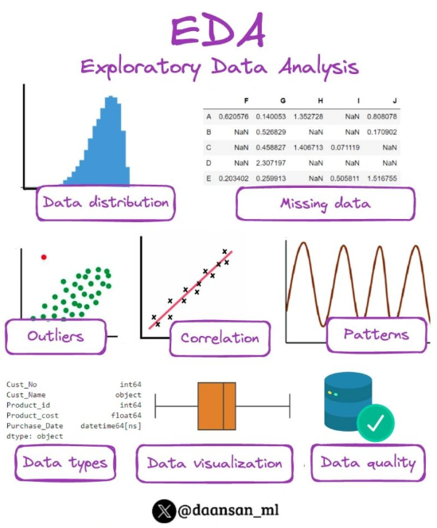
```

E' anche detta statistica descrittiva (analisi esplorativa dei dati). E' la
parte del corso più importante: prima di PREVEDERE occorre CAPIRE i propri dati.
C'è una grande quantità di statistiche disponibili in R (base o contributed).

```{r immagine16, echo=FALSE, out.width="50%", fig.cap="A nice image."}
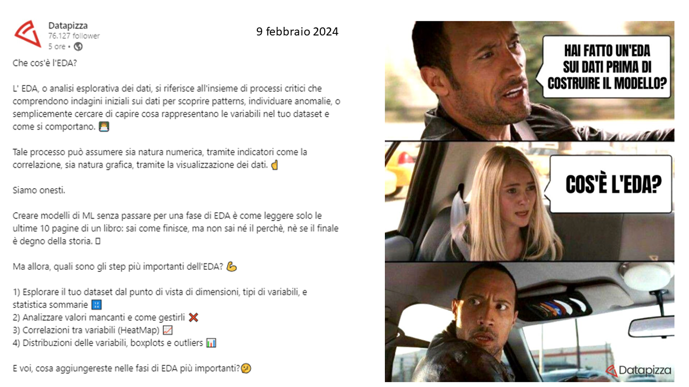
```
```{r immagine16bis, echo=FALSE, out.width="50%", fig.cap="A nice image."}
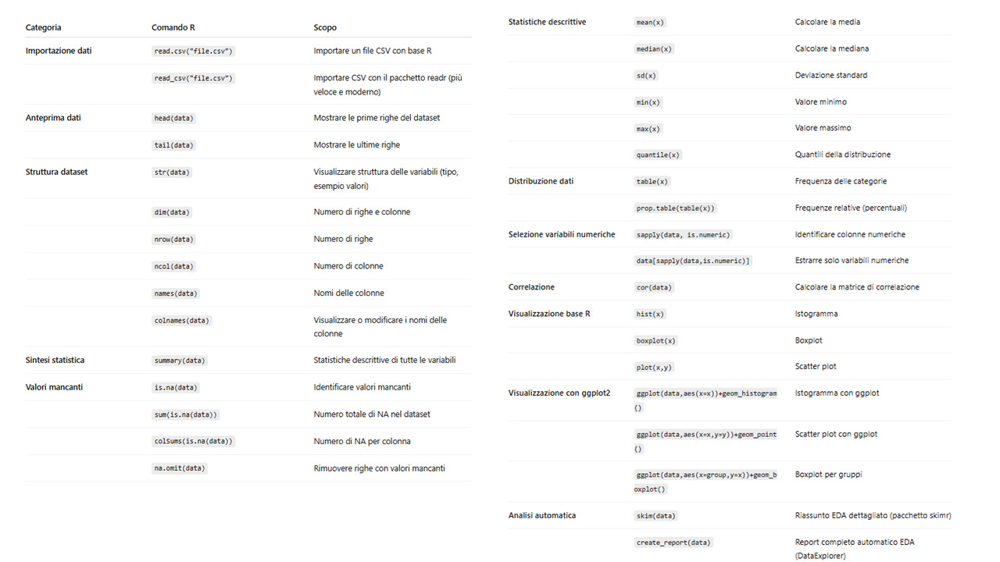
```

```{r}
# eval = FALSE --> Il codice non viene eseguito durante il knit.

library(ISLR2)
str(Credit)    # 'str' sta per 'structure'
if (interactive()) {
  View(Credit)
}

if (interactive()) {
  fix(Credit)    # per modifica - si chiude, non c'è un comando di 'salva'
}

dim(Credit)
dim(Credit)[1]
names(Credit)
```

Il codice della cella precedente può dare un **errore veramente criptico**.<br>
Qui abbiamo l'interpretazione ed il suggerimento di **chatGPT 5.2**:

```{r eval = FALSE}
url <- "https://chatgpt.com/share/69a49d53-dae8-8012-8f3d-2ced20d199d3"
browseURL(url, browser = getOption("browser"))
```

Oppure semplicemente mettere `fix` e `View` al fondo, come nella cella seguente:

```{r, eval = FALSE}
library(ISLR2)
str(Credit)
dim(Credit)
names(Credit)

if (interactive()) {
  fix(Credit)
} 
if (interactive()) {
  View(Credit)
} 

```

Chiusa parentesi errore RStudio (utile per capire).

Il campionamento del dataframe:

```{r campionamento}
head(Credit)
head(Credit,10)
tail(Credit)

# campionamento
n=10
Credit[sample(1:nrow(Credit),n, replace=FALSE),] # meglio di 'head / tail' ?!

# oppure, più semplicemente (ma non visualizza il row.id)
dplyr::sample_n(Credit, size = 10)
```

Premendo la combinazione di tasti `alt+enter` (anzichè `ctrl+enter`) il cursore
NON si sposta in avanti (molto utile se vogliamo eseguire una riga varie
volte).<br> Come verificare le scorciatoie da tastiera in RStudio?<br> Dal menù
in alto: - `Tools` --\> `Keyboard Shortcuts Help` per una sinossi delle
scorciatoie principali - `Tools` --\> `Modify Keyboard Shortcuts` --\>
`Run Current Line or Selection Without Moving Cursor` per vederle tutte e magari
modificarle.

```{r attach, eval = FALSE}
attach(Credit)   # ?? pericoloso !!
Student
```

`attach(Credit)` in un R Markdown è sconsigliato perché:

-   **inquina l’ambiente**: le variabili del dataset finiscono nel search path.
-   **crea ambiguità**: se esiste già un oggetto con lo stesso nome (es.
    `Income`), R può usare quello sbagliato.

-   **rende il documento meno riproducibile**: l’ordine dei chunk può
    cambiare il risultato.

-   è facile dimenticare `detach()`.


Metodo più solido e pulito:

```         
Credit$Income
```

oppure dentro i modelli:

```         
lm(Balance ~ Income, data = Credit)
```

Esplicito, leggibile, e non crea effetti collaterali!

Vediamo ora questa **fondamentale differenza**:

```{r immagine19, echo=FALSE, out.width="50%", fig.cap="A nice image."}

```

```{r summary}
summary(Credit)
summary(Credit$Income)
IQR(Credit$Income)
```

Su come salvare un dataframe vedi [questo ottimo
post](https://stackoverflow.com/questions/8345759/how-to-save-a-data-frame-in-r).

## Esame delle singole colonne

L'istogramma è utile per vedere la **forma** della distriuzione dei dati.

```{r istogramma}
hist(Credit$Income)
hist(Credit$Income, col=2)        # colore
hist(Credit$Income, breaks = 18)  # l'argomento 'breaks' indica il numero di 'bin'
```

Il boxplot è complementare all'istogramma.

```{r boxplot}
boxplot(Credit$Income,horizontal = FALSE)
```

```{r immagine20, echo=FALSE, out.width="50%", fig.cap="A nice image."}
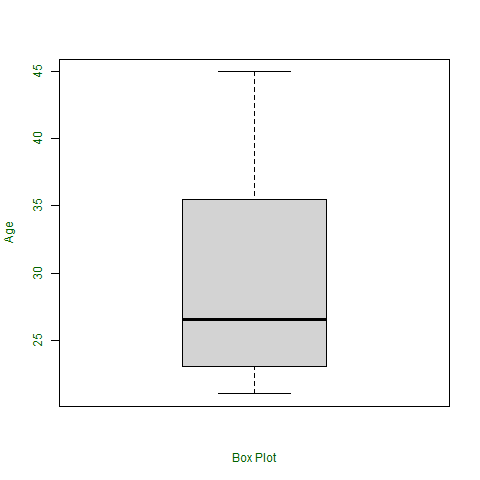
```

```{r immagine21, echo=FALSE, out.width="50%", fig.cap="A nice image."}
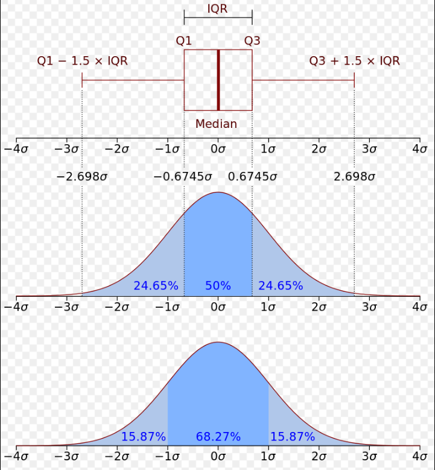
```

```{r contingenza}
# tabella di contingenza: le frequenze dei valori (dal min al max)
table(Credit$Age)

# min e max
range(Credit$Age)

# valori unici
unique(Credit$Age)
```

```{r ordinamento}
# l'ordinamento

url <- "https://stackoverflow.com/questions/54017285/difference-between-sort-rank-and-order"
# browseURL(url, browser = getOption("browser"))

sort(c(30, 10, 20, 50, 40),decreasing= TRUE)  # dà (50,40,30,20,10)   - i valori
sort(c(30, 10, 20, 50, 40))                   # dà c(10,20,30,40,50)  - i valori

order(c(30, 10, 20, 50, 40))                  # dà c(2,3,1,5,4)       - gli indici (le posizioni);
                                              # cioè: il valore più basso (posizione 1 nel ranking ascendente) è il 
                                              # secondo valore (10); la posizione 2 del ranking è del terzo valore (20), ecc
                                              # NB. Il vettore dei risultati è la corrispondenza 1:1, che qui sarebbe (3,1,2,5,4) e                                                   # non sarebbe utile per il subsetting ordinato
                                            

# le posizioni, anche dette "rank", permettono il subsetting
Credit[order(Credit$Age,Credit$Income),] # ordinamento per due colonne, cioè poer AGE, ed a parità di Age per Income

# Manipolazione stringhe alfanumeriche ------------------------------------

url <- "http://www.cs.uni.edu/~jacobson/4772/week11/R_in_Action.pdf"
# browseURL(url, browser = getOption("browser"))
# cercare nel pdf: "character functions" (p. 122)
```

## Esame d'insieme

Dopo avere analizzato le singole colonne principali, è bene dare un'occhiata al
dataframe generale, nel suo insieme.

```{r sommario}
summary(Credit)
X <- Credit$Income
range(X)
```

```{r ggally, eval = FALSE}
library(GGally)
my.vars = c("Income","Balance","Age","Cards")
ggpairs(Credit[my.vars]) # output molto informativo
ggpairs(Credit[my.vars],progress = FALSE) # output molto informativo
```

La matrice degli scatterplot:

```{r scatterplot_matrix, eval = FALSE}
my.vars = c("Income","Balance","Age","Cards")
pairs(Credit[my.vars])
# pairs(
#    ~ Income + Cards + Age,
#    data = Credit
#  )
```

```{r plot_interattivo_2, eval = FALSE}
x11()                             # eseguire l'intero blocco di istruzioni - X11 toglie il focus all'editor!
                                  # x11 crea un nuove device grafico, dimensionabile con gli argomenti 'width' e 'height'
plot(Credit$Income,Credit$Age);
if (interactive()) {
  identify(Credit$Income,Credit$Age)   # individuazione punti,
                                       # si esce dal plot con escape.
                                       # si ferma l'identificazione punti con il bottone 'stop'
}

dev.off()                         # chiude la finestra

?Devices()                        # lista dei devici grafici disponibili 
```

## Subsetting dei dataframe (aka, indexing)

```{r subsetting}
# subsetting di riga:
Credit[1,]
Credit[1:10,]
Credit[c(1,3,5),]

# subsetting di colonna (base):
Credit[,2]
Credit[,1:6]
Credit[,c(1,3,5)]
Credit[,c("Income","Age")]

# subsetting di colonna (avanzato)
Credit[Credit$Income> 50,]

idx <- which(Credit$Income>50)
Credit[idx,]

idx.max <- which.max(Credit$Income)
Credit[idx.max,]

idx.min <- which.min(Credit$Income)
Credit[idx.min,]

# subsetting di colonna esplicito
# già visto prima - qui non fornite le indicazioni per le righe
# R in questi casi interpreta l'informazione fornita come indicazione di colonna, a differenza di Python
my.vars <- c("Income","Age")
Credit[my.vars]

# subsetting di riga booleano
# poichè non abbiamo un vettore booleano pronto, lo campioniamo
set.seed(1)
idx <- sample(c(TRUE,FALSE),size=dim(Credit)[1], replace=TRUE, prob=c(0.9, 0.1) )
table(idx)
Credit[idx,]
# --> nel seguito di questo notebook vedremo due tipiche applicazioni del subsetting booloeano:
# - la separazione delle righe di training da quelle di test (in un dataframe)
# - l'esclusione dal dataframe delle righe contenenti MV

# esclusioni:
Credit[-c(1, 3), ]
Credit[-c(1, 3), -c(1, 3, 4)]

# le posizioni, anche dette "rank", permettono il subsetting
Credit[order(Credit$Age,Credit$Income),] # ordinamento per due colonne
```

## Statistiche di base

```{r sta_base}
X <- Credit$Income
sum(X)
min(X)
max(X)
range(X)         # min e max
summary(X)       # solo per X
```

```{r quantili_2}
# quantili e percentili:
x<-c(15,20,22,25,30,34,37,40,45)
quantile(x)  # --> i quantili di default

x<-c(15,20,22,25,30,34,37,40,45)
quantile(x, probs = c(0.125,0.375,0.625,0.875))  # i qunatili scelti da noi

df<-c(12,3,4,56,78,18,46,78,100)
df
quantile(df)

df<-c(12,3,4,56,78,18,NA,46,78,100,NA)
# quantile(df) # --> errore
quantile(df,na.rm = TRUE)

# quantile(df,na.rm = T,probs = c(22,77))
quantile(df,na.rm = T,probs = c(0.22,0.77))

```

R base NON fornisce le funzioni: MODA (valore più probabile) e le due misure di
SHAPE (skewness e curtosi).<br> Opzione a): si possono creare (vedi fondo -
sezione apposita)<br>

```{r stat_centrali}
url <- "https://codeburst.io/2-important-statistics-terms-you-need-to-know-in-data-science-skewness-and-kurtosis-388fef94eeaa"
# browseURL(url, browser = getOption("browser"))

mean(X)
median(X)
# Mode(X)  # definita nella sezione 'statistiche mancanti in R base'

url <-  "https://www.excelr.com/skewness-and-kurtosis"
# browseURL(url, browser = getOption("browser"))

my.vars <- c("Income","Age","Balance")
# round(sapply(Credit[my.vars],mystats),3)   # la funzione 'mystats' è definita nella sezione 'statistiche mancanti in R base'.
                                           # --> le ultime due righe dell'output riportano skewness e kurtosis:
                                           #     a) le tre distribuzioni (delle tre variabili) sono skewed (assimetriche)
                                           #     verso dx (valori positivi della skewness), in particolare 'Income' e 'Balance'
                                           #     come si può vedere dai rispettivi istogrammi. 'A ge' lo è pochissimo.
                                           #     b) 'Income' ha un picco (curtosi) più alto della gassiana (perchè valore positivo),
                                           #     le altre due variabili sono un pò più piatte della gaussiana (perchè valore negativo).

                                           #     Quest'ultima cosa si può vedere così (per 'Income'):
```

```{r kernel_estimate}
hist(x,freq = FALSE,breaks=30)
xfit <- seq(min(X),max(X),length=40)       # la griglia di valutazione
yfit <- dnorm(xfit,mean=mean(X),sd=sd(X))  # le densità gaussiane corrispondenti alla griglia (con quei parametri)
hist(x,freq = FALSE,breaks=30);lines(density(X),col="blue");lines(xfit,yfit,col="red")               
                                           # la linea "smooth" sovraimposta
                                           # la gaussiana sovraimposta (più bassa, in effetti)
```

Opzione b) usare qualche pacchetto:

```{r psych}
library(psych)   # un package con molte funzioni utili
describe(x)      # contiene anche skewness e curtosi [vedi libro su R nel Marketing]
```

```{r immagine22, echo=FALSE, out.width="50%", fig.cap="A nice image."}
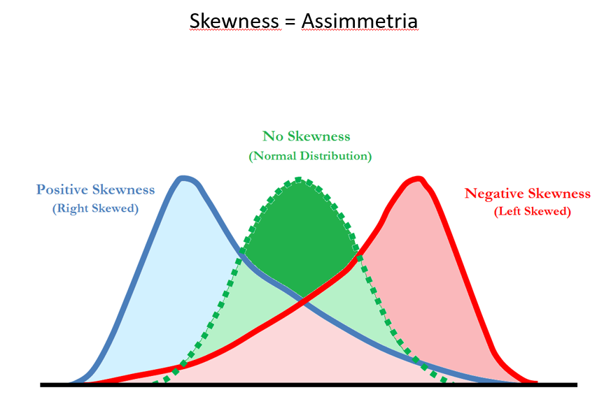
```

```{r immagine23bis, echo=FALSE, out.width="50%", fig.cap="A nice image."}
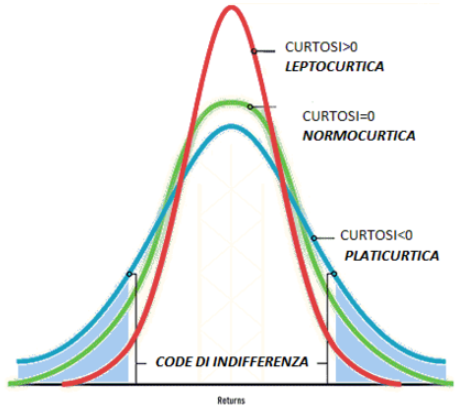
```

## Misure di centratura

```{r centratura}
X <- Credit$Income
mean(X)                    # --> 45.22 (sensibile agli outlier)
sum(X)/400                 # stesso risultato

vet.es1 <- c(1,2,3,4,5)
vet.es2 <- c(1,2,3,4,100)
mean(vet.es1)
mean(vet.es2)

median(vet.es1)
median(vet.es2)
vet.es3 <- c(1,2,3,4)
median(vet.es3)            # 2 posizioni centrali uguali ("tie": legami) --> la loro media

median(X)                  # più "robusta" (è una metrica posizionale)
X
```

## Misure di variabilità

```{r variabilità}
sd(X)                      # la deviazione standard --> 35.24
sd(vet.es1)
sd(vet.es2)                # perchè influenzata dall'outlier 100

var(X)
sd(X)^2
sqrt(var(X))               # la varianza è semplicemente il quadrato della sd, ovvero, la sd è la radice quadrata POSITIVA
                           # della varianza.
                           # la varianza NON è espressa nella unità di misura dei dati, e ciò è spesso un problema.

mad(X)                     # median absolute deviation (più robusta agli outlier)
url <-  "https://en.wikipedia.org/wiki/Median_absolute_deviation"
mad(vet.es1)
mad(vet.es2)
                           # bottom-line: 'mad' è l'equivalente per le metriche di variabilità della 'mediana' nelle metriche
                           # di centratura

# esempio di radici:
sqrt(9)                    # --> fornisce la "principal square root" (vedi help R), cioè la sola radice quadrata positiva.

sd(X)/mean(X)              # CV (Coefficiente di variazione) --> tra 0 e 1 --> qui molto alto.
                           # in generale, è possibile calcolare il CV perchè la 'sd' ha la stessa unità di misura dei dati!
```

```{r isto_breaks}
hist(X,breaks = 20)        # alta variabilità (qui rilevata tramite un istogramma, cioè un grafico delle frequenze).
                           # 'breaks' è il numero di BIN, R di default ne sceglie uno adatto al dataset.
                           # Regole pratiche di scelta numero 'breaks' ottimale:
                           # - la radice quadrata di n (il numero di osservazioni, cioè di righe) --> maggiore del default;
                           #   sqrt(length(X))=20 (il valore usato qui da me, infatti);
                           #   vedi ad esempio: "https://www.statsandr.com/blog/outliers-detection-in-r/"
                           # - prof.ssa Vicario: 1 + (10/3) * log10(n), dove log10 è il logaritmo in base 10 [in R usare la
                           #   funzione 'log10()'] ed n è il numero di osservazioni (Vicario, p. 105); QUELLO di 'hist'?!
                           # - prof. Brandimarte: min. 5 - max. 20, mai classi vuote;

                           # l'argomento 'freq' di 'hist' è importante:
                           # TRUE (il default) visualizza in ordinata le frequenze ASSOLUTE (il loro conteggio);
                           # FALSE visualizza in ordinata le frequenze RELATIVE, ovvero la base per stimare le probabilità
                           # (in modo frequentista), in modo tale che l'intera area dell'istogramma ha somma 1.
bin.vicario <- round(1 + (10/3 * log10(length(X))),0);

bin.vicario                # [la funzione 'round(X,0)' arrotonda all'intero più vicino]
hist(X,bin.vicario)        # lo stesso numero di 'hist'?!
hist(X,freq=F,breaks = 20) # osservate come l'asse delle X riporti solo alcuni valori di riferimento (50,100,150) --> R infatti è
                           # minimalista, mostra sempre il minimo delle informazioni, le altre, un'infinità volendo, si ottengono specificando
                           # esplicitamente alcuni argomenti. Nel prossimo corso vedremo diversi altri esempi di questo minimalismo di R.
```

```{r tipi_isto}
# 2 tipi di istogramma, come detto prima:
hist(X)                    # in ordinata ci sono le frequenze assolute
hist(X,freq=F)             # in ordinata ci sono le frequenze relative (cioè le frequenze assolute divise per la dimensione
                           # del campione, qui 'length(X)'), che costituiscono una stima (frequentista) delle probabilità.

# sovrapposizione all'istogramma di una curva "LISCIA" (smooth): è una "stima kernel" della PDF, non-parametrica (RIA, 2nd ed, p. 127).
lines(density(X),col="red",lwd=3) # le densità sono la stima della probabilità di X (Income) calcolata in base alle frequenze RELATIVE.
plot(density(X))                  # le densità sono calcolabili a prescindere dall'istogramma (discreto, strutturato bins) e quindi plottabili
                                  # indipendentemente.
                                  # però, se voglio plottare le densità SOPRA l'istogramma, esso deve essere stato creato con freq=F.
```

## Sezione avanzata su variabilità (dimensione del campione)

```{r variabilità_avanzata}
library(ISLR)

X <- Credit$Income
sd(X)   # con 400 osservazioni!

# NB. la standard deviation è sempre > 0! (in particolare, non è MAI negativa).
# La sd PUO' essere uguale a zero SOLO SE il campione estratto è costante.

# Il termine "standard deviation" è stato introdotto in statistica da Pearson nel 1894 assieme alla lettera greca sigma
# che lo rappresenta.

# sd calcolata dalla funzione R e, per confronto, manualmente (a passi) con la formula (Wikipedia IT)
sd(X)                         # --> 35.24
scarti <- X-mean(X)           # --> il vettore degli scarti (nella formula: Xi - X-bar)
scarti.quad <- scarti^2       # --> il vettore deglli scarti al quadrato (nella formula l'apice 2) 
ssr <- sum(scarti.quad)       # --> il numeratore della formula (in gergo statistico SSR = Sum of squared Residual) 
(X.var <- ssr/(length(X)-1)) 
(X.std <- sqrt(X.var))        # --> 35.24

# la funzione 'sd' divide per n-1 gradi di libertà:
sqrt(sum(scale(X,center=T,scale=F)^2)/(length(X)-1)) # formula della deviazione standard (vedi Wikipedia):
# la radice quadrata della somma degli scarti al quadrato divisi per n-1.
# n-1 è un aggiustamento numerico (perchè la media della popolazione è stata stimata con la media campionaria,
# e quindi si è perso un grado di liberta - i gdl sono le osservazioni).
# attenzione nei piccoli campioni! --> /n oppure /n-1 è ben diverso!

# 'scale(X,center=T,scale=F)' equivale a 'X-mean(X)'.
# NB. il suriportato comando illustra il funzionamento VETTORIALE di R.

# la standard deviation è una misura di VARIABILITA' dei dati (come var e mad).
# la variabilità si riduce al crescere del numero di osservazioni (le righe del df).
# [pensiamo alle proiezioni delle elezioni: la forchetta di variabilità della percentuale ottenuta da un certo partito
# si riduce mano a mano che i seggi sono scrutinati].
# perchè ciò? se la dimensione del campione è bassa, la presenza di uno o pochi OUTLIER può influenzare molto la media
# (la deviazione standard è infatti una MEDIA, per questo è anche detta "scarto quadratico medio").

# verifichiamo questo fenomeno:
m <- dim(Credit)[1]
n <- dim(Credit)[2]
m;n                     # m,n è notazione di algebra lineare.
                        # nel machine learning si usa in genere n,p (ad es. nel libro ISLR)

sd.set <- double(m)                   # inizializzazione a zero del vettore (più veloce)

for (i in 1:m) {
  # X <- Credit$Income[1:i]                     # dati estratti SEQUENZIALMENTE (i precedenti outlier continuano ad influenzare!)
  # X <- sort(Credit$Income[1:i])               # dati estratti in ORDINE (c'è comunque un BIAS nei dati, cioè una deformazione
                                                # introdotta dall'ordinamento)
  X <- sample(Credit$Income,i,replace=FALSE)    # dati estratti CASUALMENTE (meglio, diversi)
  sd.set[i] <- sd(X)
}

plot(sd.set,xlab="Dimensione del campione",ylab="Valore della deviazione standard")
# --> dopo 50 osservazioni circa la deviazione standard si stabilizza (intorno a 35)

# nota sul campionamento (sampling):
set.seed(1)                           # per la riproducibilità dei risultati (random seed)
sample(1:10,3,replace=FALSE)          # non c'è MAI due volte lo stesso elemento (dentro la tripletta estratta)!
                                      # verificarlo selezionando il comando e ripetendo 'Run' diverse volte.
sample(1:10,3,replace=TRUE)           # lo steso elemento può così invece ricomparire nella tripletta estratta.

# debug del ciclo (utile ad esempio per vedere variabili LOCALI ad un ciclo):
# - breakpoint e poi 'Source' (e non 'Run')
# - la prima sd è 'NA' perchè non c'è variabilità con una sola osservazione
sd(Credit$Income[1:1])   # --> NA
sd(Credit$Income[1:2])   # --> ok

# SE LA VARIABILITA' DEL FENOMENO/CAMPIONE SOTTO STUDIO E' BASSA, LE PREVISIONI SONO PIU' AFFIDABILI.
# qual è dunque la dimensione minima (ottimale) del campione? campionare COSTA!
# se la variabile è solo una, servono almeno 30-50 osservazioni (la causa è "il teorema del limite centrale");
# se le variabili sono parecchie, come spesso accade, servono almeno:
# - 10 osservazioni per ogni variabile  # p=3 --> versione lasca: almeno n = 30 oss (per ridurre la sd);
#                                                 versione conservativa: 10 per la prima var, altre 10 per ognuna dei valori
#                                                 della prima var, etc --> 10^3=1000
# - oppure: n > 5(p+2); p=3 --> 5(3+2) = 25 (simile alla prima regola lasca)
# attenzione: sono "regole del pollice"!

# per una trattazione più teorica (matematica) di questo tema (la dimensione del campione), vedi il PDF
# allegato, con tre pagine estratte da un libro del prof. Brandimarte di qualche anno fa. [scusate le note
# mie a mano!]
```

# Rilevamento degli outlier

```{r outlier, eval = FALSE}
# Outlier detection (multi-variati) -------------------------------------------------------
library(ISLR)
attach(Credit)

# "outlier": che sta fuori

# lo strumento principe è il boxplot.
boxplot(Income, range=0.8)  # qual è il giusto valore per l'argomento 'range'?

# outlier applicativi:
# - oltre +- 3 sigma (con la gaussiana è il 99.73% dell'area)
# - oltre Q1-1.5*IQR Q3+1.5*IQR (il default della funzione R 'boxplot')
# - secondo la vostra regola di BUSINESS.

# e nel multi-variato??

set.seed(1)
x <- c(sort(runif(100)),0.2)    # campionamento casuale da una distribuzione uniforme con min 0 e max 1 (uniforme standard) + singolo punto x
y <- c(sort(runif(100)),0.5)    # idem + singolo punto y
plot(x,y);points(0.2,0.8,col="red",pch=20);plot(1:20,1:20,pch=1:20) # la lista dei pch

# il punto (0.2,0.8) è un outlier BI-variato (non lo è nè rispetto ad x nè rispetto ad y singolarmente prese);
# cioè è "una combinazione INUSUALE delle variabili del dataset".

# si rileva con la distanza di Mahalanobis.
# [MATH. calcola le distanze dal centro (il vettore medio) per tutte le componenti dell'osservazione multi-variata
# tenendo conto anche delle distorsioni operate dalle correlazioni].

df <- data.frame(cbind(x,y))
mat <- as.matrix(df)
mah.dist <- mahalanobis(x=mat,center=colMeans(mat),cov=cov(mat))  # la matrice di covarianza è l'estensione multi-variata del concetto di deviazione standard
plot(mah.dist)

# riprovare con outlier (0.4,0.6) --> mahalanobis distance cmq alta

# applicato al nostro dataset:
my.vars <- c("Income","Age","Education","Balance") # 4 variabili (spazio non visualizzabile)
mah.dist <- mahalanobis(x=Credit[my.vars],center=colMeans(Credit[my.vars]),cov=cov(Credit[my.vars]))
plot(mah.dist); identify(mah.dist)
mean(mah.dist);sd(mah.dist)

# che threshold per la distanza di Mahalanobis?
mean(mah.dist);sd(mah.dist)  # +- 3 sigma?
hist(mah.dist,breaks = 60)   # non è per nulla gaussiana

# il miglior threshold è il seguente:
url <- "https://easystats.github.io/performance/reference/check_outliers.html#:~:text=Mahalanobis%20Distance%3A%20Mahalanobis%20distance%20(Mahalanobis,the%20shape%20of%20the%20observations.&text=By%20default%2C%20the%20alpha%20threshold,observations%3B%20Cabana%2C%202019)."
# browseURL(url, browser = getOption("browser"))
# Mahalanobis distance (Mahalanobis, 1930) is often used for multivariate outliers detection as this distance takes into account
# the shape of the observations. The default threshold is often arbitrarily set to some deviation (in terms of SD or MAD) from the mean
# (or median) of the Mahalanobis distance. However, as the Mahalanobis distance can be approximated by a Chi squared distribution (Rousseeuw
# & Van Zomeren, 1990), we can use the alpha quantile of the chi-square distribution with k degrees of freedom (k being the number of columns).
# By default, the alpha threshold is set to 0.025 (corresponding to the 2.5% most extreme observations; Cabana, 2019). This criterion is a
# natural extension of the median plus or minus a coefficient times the MAD method (Leys et al., 2013).

MD.thr <- qchisq(p=1-0.025,df=ncol(Credit[my.vars]))  # sia n che (n-p) devono essere > 25-30 (prof. DeBlasi)
# 0.975 è il quantile più usato (De Blasi usa .95 e .99)
plot(mah.dist);abline(h=MD.thr,col="red");identify(mah.dist)

# ed ora il check, ad esempio del valore più estremo:
Credit[324,my.vars]       # perchè questa combinazione è così inusuale?

summary(Credit[my.vars])  # il punto 324 ha 'age' massima, 'balance' massimo, 'income' quasi massimo, 'education' oltre Q3
# (cioè è nel 25% con 'education' più alta).
# caspita! chi è?

Credit[4,my.vars]         # un valore meno estremo (anche se outlier).
# il punto 4 ha 'income' oltre Q3, 'age' sotto Q1, 'education' uguale a Q1, 'balance' oltre Q3.

# --> MD tine conto di TUTTE le 4 dimensioni, tine conto delle correlazioni tra di esse.

# nessuna singola componente di questo punto, a parte forse Income, è un outlier!

# controlliamo allora 'Income' in modo univariato, usando il codice visto prima:
X <- Income
outlier <- boxplot(X,range=1.5,plot=F)$out
names(X)<-1:length(X)
boxplot(X,range=1,plot=T);identify(rep(1,length(X)), X, labels=names(X))   # click multiplo, non semplice

Credit[4,"Income"] %in% outlier         # TRUE, è un outlier rispetto a Income

# la Data Science si ferma qui; serve conoscenza business del dataset, ora.

pairs(Credit[my.vars])      # scatterplot matrix
library(GGally)
ggpairs(Credit[my.vars])    # more info.
                            # la distribuzione di 'age' è leggermente bi-modale.
                            # Brandimarte, pp. 213-214: la seconda moda può essere:
                            # - rumore (lisciabile);
                            # - un'altra sotto-popolazione;
                            # - un'altra tipologia di dato, es. tempo di riparazione macchina per problemi ordinari o gravi,
                            #   oppure tempo di evasione ordine per articoli in-stock o saltuariamente out-of-stock.


```

# Gestione dei MV

Da [questo
post](https://www.linkedin.com/posts/avi-chawla_machinelearning-datascience-activity-7176135921082195969-ODEt?utm_source=share&utm_medium=member_desktop):<br>
The first step towards missing data imputation must NEVER be imputation.<br> The
data imputation strategy largely depends on WHY data is missing. Only when we
determine the reason can we proceed with the appropriate imputation techniques,
which could be of three types:

-   𝐌𝐢𝐬𝐬𝐢𝐧𝐠 𝐜𝐨𝐦𝐩𝐥𝐞𝐭𝐞𝐥𝐲 𝐚𝐭 𝐫𝐚𝐧𝐝𝐨𝐦 (𝐌𝐂𝐀𝐑)

The data is genuinely missing at random and has no relation to observed or
unobserved variables.<br> For instance, in survey responses with missing values,
MCAR would mean that some participants randomly skipped to answer a random
question.<br> However, in my experience, *MCAR is mostly an unrealistic
assumption.*<br> This is because, in real-world scenarios, the occurrence of
missing data is often influenced by some factor, observed or unobserved.<br>
That is why assuming MCAR for missing data is not a sensible assumption unless
we know the end-to-end data collection process and/or have domain expertise.<br>
That said, nothing stops us from assuming MCAR if that appears to be a fair
thing to do based on the analysis and/or input from the domain experts and/or
after understanding the data collection mechanism. We can proceed with the
simplest imputation techniques.<br>

-   𝐌𝐢𝐬𝐬𝐢𝐧𝐠 𝐚𝐭 𝐫𝐚𝐧𝐝𝐨𝐦 (𝐌𝐀𝐑)

MAR is a situation in which the missingness of one feature can be explained by
other observed features in the dataset.<br> In contrast to MCAR, MAR is more
practically observed and its occurrence can still be (somewhat) estimated based
on the information available in the dataset.<br> For instance, in an academic
performance survey, students with higher grades might be less likely to disclose
information about the number of hours they study (due to competition,
maybe).<br> Techniques like kNN imputation, Miss Forest, etc., are quite
effective. They use other observed features to impute the missing feature. Check
the comments to learn how they work.<br>

-𝐌𝐢𝐬𝐬𝐢𝐧𝐠 𝐧𝐨𝐭 𝐚𝐭 𝐫𝐚𝐧𝐝𝐨𝐦 (𝐌𝐍𝐀𝐑) MNAR is the most complicated of all three.<br>
Here, missingness is either attributed to the missing value itself or the
feature(s) we didn't collect data for.<br> For instance, in a health survey,
participants with very high stress levels might not disclose it due to stigma,
or fear of judgment.<br> As a result, the missing data on stress level is not
random; it is influenced by the stress level itself.<br> **Higher the stress
level → the less likely one will disclose it → the more likely we get a missing
value.**<br>

Thus, the missingness is directly dependent on the very variable that is
missing.<br> There's not much we can do here, except for collecting more
features. What's more, domain expertise become extremely important to smartly
tackling MNAR and improving data collection process.<br> There's one more way to
(somewhat) handle MNAR with caution. I discussed this in detail here:
<https://lnkd.in/gDBZF6tV>.

```{r immagine23, echo=FALSE, out.width="50%", fig.cap="A nice image."}
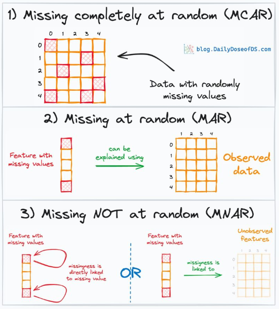
```

```{r MV, eval = FALSE}
# --> in R chiamati NA (Not Available)

data(sleep,package="VIM") # VIM è un package per la gestione dei MV
data(package="VIM")       # la lista dei dataset SOLO del package indicato (VIM)
# carica in memoria uno specifico dataset
# <Promise object> ? (vedi pane Environment): click sopra.
dim(sleep)
View(sleep)

# MV detection (so: 24027605):
is.na(sleep$Sleep)                       # vettore di booleani (la colonna 'sleep' del df 'sleep'), scomodo da leggere se grandi dimensioni;
                                         # funzionamenmto vettoriale di R: 1 comando applicato a tutti gli elementi del vettore;
                                         # --> True significa NA.

sum(is.na(sleep$Sleep))                  # per singola colonna (ma sono tante!)
sum(is.na(sleep))                        # in totale sull'intero dataframe (ma in quali righe?)
apply(sleep,2,function(x) sum(is.na(x))) # sinossi utile (per colonna)
apply(sleep,1,function(x) sum(is.na(x))) # sinossi utile (per riga)

sapply(sleep, function(x) sum(is.na(x))) # sinossi utile (lo stesso, con la funzione sapply che restituisce un vettore)

complete.cases(sleep)                     # un vettore di booleani che indicano, per ogni riga, se essa NON ha MV (cioè è completa)
                                          # oppure no;
                                          # come suggerisce il nome della funzione ('complete.cases'), TRUE qui significa assenza di NA
sum(complete.cases(sleep))                # the number of rows that do NOT have ANY missing values (ie, complete): 42.
                                          # cioè, per complemento a 62 (il numero totale di righe), ci sono 20 righe con MV.
sum(!complete.cases(sleep))               # il complemento (l'operatore '!' inverte il booleano)

# ricordandoci che un df può essere subsettato (per riga) anche con un vettore di booleani (ogni booleano dice ad R se "quella"
# determinata riga dev'essere estratta oppure no.
sleep[complete.cases(sleep),]             # la lista delle righe complete.
sleep[complete.cases(sleep),][,c("NonD")] # subsetting a cascata: i valori della colonna 'NonD' nelle righe complete.

# alcuni check:
sleep[c(3,4),]                            # due righe non complete: infatti hanno NA
sleep[c(19,20,21),]                       # idem

sum(!complete.cases(sleep))               # the number of rows that DO have missing values (at least 1): 20

# subsetting booleano opposto
sleep[!complete.cases(sleep),]            # la lista delle righe non complete: ognuna ha almeno un NA

library(mice)
md.pattern(sleep,plot=TRUE) # molte combinazioni
# prima colonna: numero righe con quel pattern; ultima colonna: numero variabili con MV (in quel pattern).
# ogni riga rappresenta un possibile pattern di 'missingness': 0 significa MV per quella colonna, 1 significa non-MV.
# La prima riga descrive il pattern "no MV" (tutti gli elementi sono 1).
# La seconda riga descrive il pattern "no MV eccetto che per le colonne 'Dream' e 'NonD'.
# La prima colonna indica il numero di righe in ogni pattern, l'ultima colonna indica il numero di variabili con MV.
# Riga totale: numero di MV per ogni colonna.

library(VIM)                 # VIM è un package per la gestione dei MV
aggr(sleep,prop=F,numbers=T,bars=F,cex.axis=0.6) # grafico
                                                 # il secondo plot è la versione grafica della funzione 'md.pattern'

# molte funzioni R hanno l'argomento 'na.rm=T/F';
# usiamo una colonna di 'sleep' che abbia MV, ad es. 'NonD':
sum(sleep$NonD)            # --> la funzione 'sum' è NA (Not Applicable) perchè ci sono dei MV
sum(sleep$NonD,na.rm=T)    # ok! (la somma sui 62-14 valori di 'NonD' presenti)

# omit NAs sul dataset PIENO
sleep = na.omit(sleep)
if (interactive()) {
  ?View(sleep) # ??
}
dim(sleep)

# e nei nostri dataset?
md.pattern(Credit,plot=FALSE)   # no MV
# md.pattern(Auto,plot=FALSE)     # no MV
# md.pattern(Carseats,plot=FALSE) # no MV
# md.pattern(Adv,plot=FALSE)      # no MV
# md.pattern(Boston,plot=FALSE)   # no MV

# mappa visiva dei NA, ora:
library(Amelia)
data(sleep,package="VIM")       # VIM è un package per la gestione dei MV
dim(sleep)
missmap(sleep)                  # dim(sleep) --> 62 x 10 --> 620 scalari (singole celle).
                                # 38 MV in totale (da output di 'md.pattern') --> 6%
missmap(Credit)

# errore! segnala come mancante la colonna 'sleep' delle prime righe, che non è vero

# altro su MV/NA è nel corso R avanzato.

```

Esistono diverse tecniche per **gestire** i MV:<br>

```{r immagine24, echo=FALSE, out.width="50%", fig.cap="A nice image."}
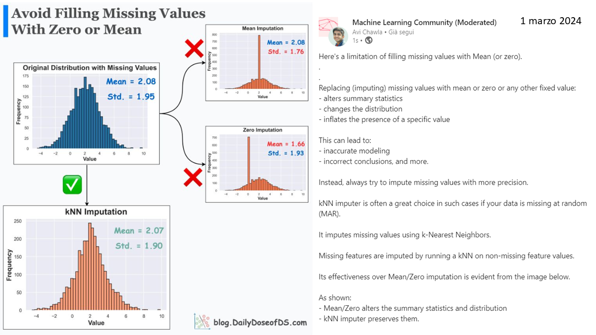
```

# More on MV

```{r more_on_MV, eval=FALSE}
# More on MV mgmt ---------------------------------------------------------

# funzioni 'is.na', 'na.omit', 'complete.cases', 'md.pattern' (mice): già visti nel primo corso.

# alcune importanti aggiunte (quattro: A, B, C, D).

# A) classificazione MV/NA (RIA, 1st ed. p.354):
# - MCAR (Missing Completely At Random): la presenza di NA in una variabile è scollegata da altre variabili (osservate o no);
# - MAR (Missing At Random):              "     "    "  "  "   "     "      " collegata ad altre variabili
# - NMAR (Not Missing At Random): nè MCAR nè MAR

# B) correlazione tra MV:
# una shadow matrix: replace data with binary variables (1 for NA, 0 for present);
# la shadow matrix è usata anche dalla funzione 'md.pattern'.
x <- as.data.frame(abs(is.na(sleep))) # la shadow matrix ('abs' trasforma T/F in 1/0)
head(sleep,n=5)                       # le prime 5 righe del dataset
head(x,n=5)                           # le prime 5 righe della shadow matrix
apply(x,2,sd)                         # per eliminare le colonne della shadow matrix con sd=0 (cioè le cui colonne originali NON hanno NA, ad es. BodyWgt e BrainWgt)
y <- x[which(apply(x,2,sd)>0)]
cor(y)     # la correlazione (di Pearson) si può calcolare anche tra variabili binarie (altrimenti si usa la correlazione tetracorica):
# url: http://www.insular.it/2013/08/misurare-lassociazione-tra-variabili-dicotomiche/
# url: http://www.insular.it/2013/08/correlazione-tetracorica-o-indice-di-pearson/

# Dream e NonD tendono ad essere MANCANTI INSIEME (r=0.91). Non sono MCAR.
# In misura minore, Sleep e NonD anche (r=0.49) e Sleep e Dream (r=0.20).

cor(sleep,y,use="pairwise.complete.obs")
# ['use' is an optional character string giving a method for computing covariances in the presence of missing values (R help).]
# sono le relazioni tra la presenza di NA in una variabile e i valori osservati nelle altre.
# le righe sono le variabili osservate, le colonne sono variabili binarie.
# ignorare i NA in questo output (non sono significativi).
# dalla prima colonna: i valori NonD sono più facilmente mancanti (NA) se BodyWgt è alto (r=0.227), se Gest
# è alto (r=0.202), e se Exp è alto (r=0.245).
# stessa interpretazione per le altre colonne.

# non ci sono valori alti in questa tabella, probabilmente i NA sono MAR.

# C) Gestione degli NA (e non solo il rilevamento): molti Data Scientist purtroppo non si pongono questo problema.

# 1) cancellare l'intera riga nella quale ci siano uno o più NA; è il default di molte funzioni statistiche; è l'approccio più sicuro;
# ad es.
findata<-read.csv("FinancialIndicators.csv",header=TRUE,nrows = 7112,comment.char = "")
dim(findata)
findata.2 <- na.omit(findata)
dim(findata.2)

library(dplyr)     # per l'utile funzione count'
count(findata[complete.cases(findata),]) # 687 righe senza nessun NA! (meno di un decimo)
findata = na.omit(findata)
dim(findata)       # una grossa perdita informativa;
# secondo problema: si assume che gli NA siano MCAR. è davvero così?
# esempio: questionario di soddisfazione clienti: molti campi, con tipo impiego (dipendente od autonomo)
# e reddito annuale. E' possibile che gli autonomi siano più propensi a non dichiarare il reddito
# e magari, per tutela, a non dire che sono autonomi.
# cioè ci può essere una correlazione tra gli NA dei due campi, che con la cancellazione righe si perde.

# 2) imputazione multipla dei campi con NA:
# - mean/median(colonna)
# - simulazione Montecarlo
# - chained equations
# - regressione (medie condizionate): so 49634504, 11000
# package R utili: 'Amelia', 'mice', 'mi'.
# Dettagli sul libro "R in Action" di R. Kabacoff (pdf on-line gratis);
# meglio la seconda edizione

# D) Percentuale ammessa di valori imputati (rispetto al totale):
# vedi email di ton dewaal.

# uno dei libri di riferimento in quest'area:
url <- "https://www.amazon.it/Handbook-Statistical-Data-Editing-Imputation/dp/0470542802/ref=sr_1_1?__mk_it_IT=%C3%85M%C3%85%C5%BD%C3%95%C3%91&dchild=1&keywords=handbook+of+statistical+data+editing+and+imputation&qid=1606999839&s=books&sr=1-1"
# browseURL(url, browser = getOption("browser"))

data(sleep,package="VIM")# "Mammal sleep data".

# parentesi:
# attenzione: ci sono parecchi dataset 'sleep' (nel pane di help se ne ottiene uno differente)
# DT::datatable(all_ds)    # funzione e dataset fornito dal MIO script 'Finding a dataset.R']
# --> nella funzione 'data', cioè, bisogna specificare il package! (come fatto sopra)
# stesso problema a volte con le funzioni.

View(sleep)              # molti NA
str(sleep)               # la variabile 'Dream' è continua (con NA)
attach(sleep)
summary(Dream)
sum(is.na(Dream))

# uno degli approcci migliori :
lm(Dream ~BodyWgt+BrainWgt+Pred+Exp+Danger,data=sleep)$fitted.values           # alt+126 per la tilde;
                                                                               # utilizzo solo predittori senza NA.
# omette le righe con NAs.
lm(Dream ~BodyWgt+BrainWgt+Pred+Exp+Danger,data=na.omit(sleep))$fitted.values  # la stessa cosa

sleep.fit <- lm(Dream ~BodyWgt+BrainWgt+Pred+Exp+Danger,data=na.omit(sleep))
predict(sleep.fit,newdata = sleep[!complete.cases(sleep),],) # help 'na.fail'  # i migliori NA!

```

# La standardizzazione

Standardizazione, cioè: centratura (cioè sottrarre il valor medio) e rescaling
(ovvero dividere per la dev. std):

```{r immagine25, echo=FALSE, out.width="50%", fig.cap="A nice image."}
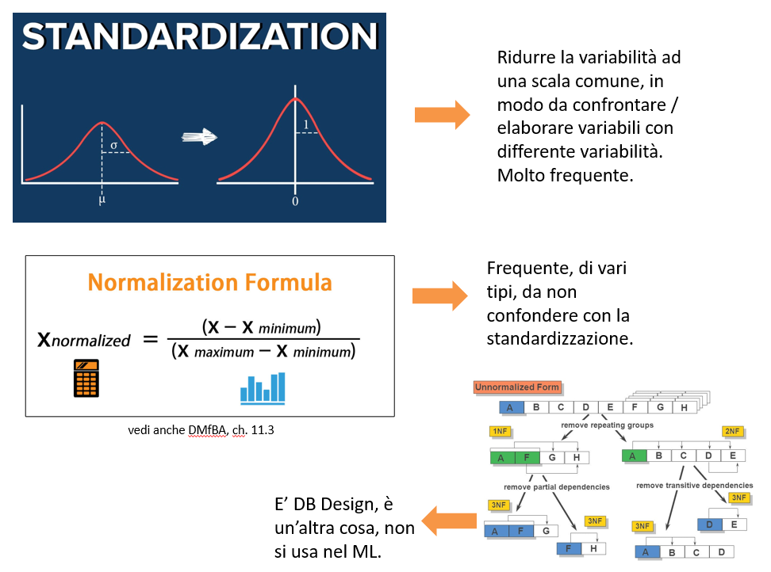
```

```{r dev_std}
(X.std <- scale(X,center=T,scale=T))  # i due attributi riportati in coda sono media e varianza originali;
                                      # gli attributi sono anche visibili con 'attributes(object.name)'.

hist(X.std)
mean(X.std)                           # 0 (-2.9142e-18 = -291.42e-16)
sd(X.std)                             # 1 (è sempre lo scaling DOPO la centratura - vedi help R)

# controverifica manuale (che sfrutta il funzionamento vettoriale di R (e di python)

(X.std.10 <- scale(X[1:10],center=T,scale=T))
res = (X[1:10]-mean(X[1:10]))/sd(X[1:10]);res

```

La standardizzazione è utile in diversi casi: - diverse tecniche di ML
richiedono che i dati siano standardizzati: quando si calcolano "distanze" (ad
es. KNN, PCA, clustering, FA, ecc), quando l'algoritmo non è scale-invariant,
ecc - nella EDA le differenze di scala possono essere una complicazione. <br>
Facciamo un **esempio** di standardizzazione utile per la EDA:

```{r new_boxplot}
boxplot(Credit)
```

I boxplot NON sono visualizzati e non sono confrontabili.

```{r scale}
my.vars <- c('Income','Limit','Rating','Cards','Age','Education','Balance')
boxplot(scale(Credit[my.vars]))
```

In questo modo i boxplot sono tutti visualizzati bene e sono confrontabili.

Un altro vantaggio della 'standardizzazione' è di poter CONFRONTARE
distribuzioni differenti; esempio:

```{r cfr_scale}
par(mfrow=c(1,2))
hist(Credit$Income)
hist(Credit$Age)
par(mfrow=c(1,1))
par(mfrow=c(1,2))
hist(scale(Credit$Income))
hist(scale(Credit$Age))
par(mfrow=c(1,1))
```

Vediamo qui sopra chiaramente che la variabilità di 'Income' è di -1sd / +4sd,
molto maggiore di quella di 'Age', che è di -2sd / + 2sd. Un'informazione SIMILE
la posso ottenere con 'range'.<br>

Attenzione: spesso si usa (impropriamente) il termine 'normalizzazione', che
invece è la trasformazione dei dati in gaussiani.<br>

Vediamo le due operazioni separatamente:

```{r centratura_2}
# centratura:
X.std <- scale(X,center=T,scale=F) # solo centratura (cioè uno shift)
mean(X.std)                        # --> e-16 è 0 al computer
sd(X.std)                          # quella originale
scale(X,center=T,scale=F)          # riporta in coda solo il centro originale! (la sd non è cambiata)

# rescaling (caso particolare):
X.resc <- scale(X,center=F,scale=T) # solo rescaling
mean(X.resc)                        # 0.78
sd(X.resc)                          # 0.61


par(mfrow=c(2,2))
hist(X)
# hist(Y)
hist(scale(X,scale=T))              # 'hist' dei dati riscalati (cioè divisi per la sd)
# hist(scale(Y,scale=T))
```

"When data is rescaled the median, mean(μ), and standard deviation(σ) are all
rescaled by the same constant."
(<https://www.statisticshowto.com/what-is-rescaling-data/>)<br>

"The root-mean-square for a (possibly centered) column is defined as
`sqrt(sum(x^2)/(n-1))`, where `x` is a vector of the non-missing values and `n`
is the number of non-missing values. In the case `center = TRUE`, this is the
same as the standard deviation, but in general it is not. (To scale by the
standard deviations without centering, use
`scale(x, center = FALSE, scale = apply(x, 2, sd, na.rm = TRUE))`.)

```{r destandardizzazione}
# destandardizzazione (anch'essa vettoriale):
X.destd <- (X.std * sd(X)) + mean(X)
# verifica:
head(X.destd,10)
head(X,10)

```

# Variabili categoriche

```{r var_cat}
Y <- Credit$Student   # una variabile categorica
class(Y)
levels(Y)
table(Y)
summary(Y)           # uguale a 'table(Y)'
```

# Quantili e distribuzione empirica

```{r quantili}
q.40 <- quantile(X,0.4)   # il "quantile", a volte anche detto "percentile" (so 156778), è UN VALORE SPECIFICO della X (è un income);
q.40                      # --> cioè, il 40% delle osservazioni ha valore di Income <= 27.81
                          #     e quindi il restante 60% delle osservazioni ha valore di Income > 27.81

hist(X,breaks = 30);abline(v=q.40,col="Red",lty=2,lwd=3)   # funziona SOLO sopra un grafico già prodotto

fivenum(X)        # "returns Tukey's five number summary (minimum, lower-hinge, median, upper-hinge, maximum)"

plot(ecdf(X))     # la CDF empirica --> conferma graficamente che un valore di Income intorno a 27.81 lascia alla sua sx il 40% delle obs.
                  # In generale, la CDF (Cumulative Distribution Function) riporta in ordinata la Prob(X<=X.k), dove X.k è un valore dato
                  # in ascissa.
```

# Statistiche su due variabili numeriche

```{r due_var}
X.1 <- Credit$Income
X.2 <- Credit$Balance
```

## La covarianza e la correlazione

La covarianza è un valore assoluto, non diviso per le sd delle due
variabili.<br>

```{r covarianza}
cov(X.1,X.2)
```

La **correlazione**, che è una covarianza standardizzata, è in genere più utile
della covarianza, perchè confrontabile tra variabili e comunque il suo range di
possibili valori è noto a priori.<br> Per default, il comando `cor` usa il
metodo di Pearson.<br>

```{r corr_pearson}
cor(X.1,X.2,method = "pearson") 
```

La correlazione è semplicemente la covarianza standardizzata,cioè un numero tra
-1 e 1, dove 0 --\> non-correlazione, +1/-1 --\> massima correlazione
(l'intensità correlazione).<br> \|cor\| \> 0.5: interessante.<br> \|cor\| \>
0.7-0.8: alta (dipende dal dominio applicativo: nel "socio-demografico"
correlazioni in genere più basse; nei domini scientifici-ingegneristici
correlazioni più alte, mondo finance: via di mezzo).<br> Correlazione positiva
(\>0) --\> le due variabili crescono OPPURE diminuiscono INSIEME.<br>
Correlazione negativa (\<0) --\> al crescere di una variabile, l'altra decresce,
o viceversa. <br>

```{r immagine26, echo=FALSE, out.width="50%", fig.cap="A nice image."}
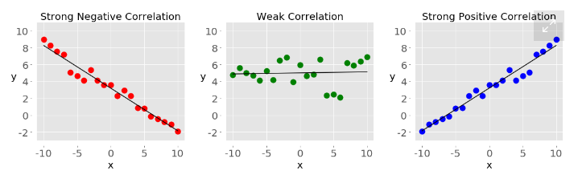
```

I metodi di calcolo della correlazione (argomento `method`): - Pearson
(default), - Spearman (più "robusta" perchè usa le posizioni (ranking) anzichè i
valori, ed in grado di misurare anche le relazioni non-lineari) - kendall

```{r corr_spearman}
cor(X.1,X.2,method = "spearman")  # la correlazione calcolata in modo "robusto agli outlier", cioè con le posizioni anzichè i valori;
                                  # inoltre, individua anche relazioni non-lineari.
```

**La correlazione INDICA ASSOCIAZIONE tra le due variabili, NON CAUSA-EFFETTO!**
--\> Vedi il libro "How to lie with statistics" di Darrell Huff (1954).<br> La
regressione si fa, poi, quando c'è causa-effetto! [Vicario].<br>

Nella esplorazione dei dati la correlazione si misura su una COPPIA di variabili
(numeriche). Nella regressione, che è una tecnica di previsione che vedremo nel
prossimo corso, si misura anche la possibile correlazione tra molte variabili,
che prende il nome di "multi-collinearità".

La correlazione si può valutare anche con un grafico a dispersione
(scatterplot):

```{r jitter}
X.1.jit <- jitter(X.1)     # "add a small amount of noise to a numeric vector." Evita (l'eventuale, non qui) overlap dei punti
X.2.jit <- jitter(X.2)
plot(X.1,X.2,col="black");points(X.1.jit,X.2.jit,col="red") 
                           # 'points' stampa SOPRA un plot già aperto (altre funzioni così, es. 'lines')
```

Vediamo uno scatterplot interattivo (vedi altri in seguito).

```{r plot_interattivo, eval=FALSE}
x11()                             # eseguire l'intero blocco di istruzioni - X11 toglie il focus all'editor!
                                  # x11 crea un nuove device grafico, dimensionabile con gli argomenti 'width' e 'height'
plot(X.1,X.2);
if (interactive()) {
  identify(X.1,X.2)   # individuazione punti,
                      # si esce dal plot con escape.
                      # si ferma l'identificazione punti con il bottone 'stop'
}
dev.off()                         # chiude la finestra

# ?Devices()           # lista dei devici grafici disponibili - ne abbiamo già visti alcuni
```

**La correlazione non è causa-effetto**.

```{r immagine27, echo=FALSE, out.width="50%", fig.cap="A nice image."}
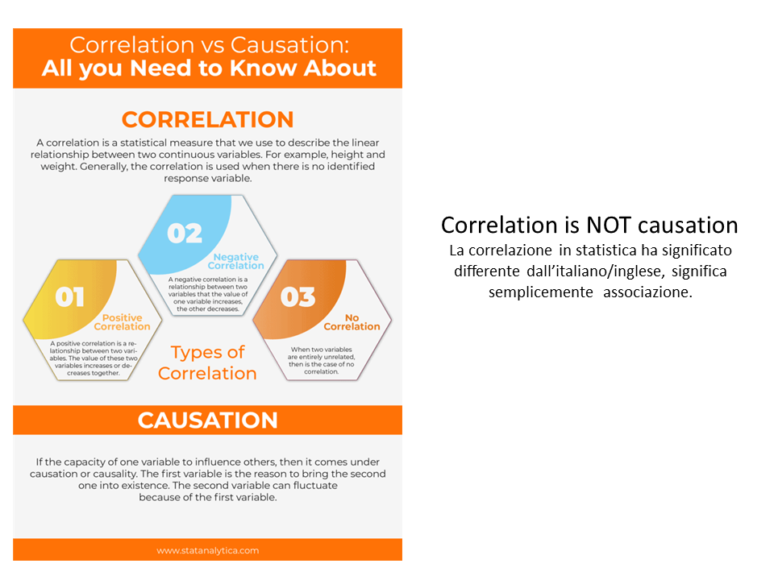
```

```{r immagine28, echo=FALSE, out.width="50%", fig.cap="A nice image."}
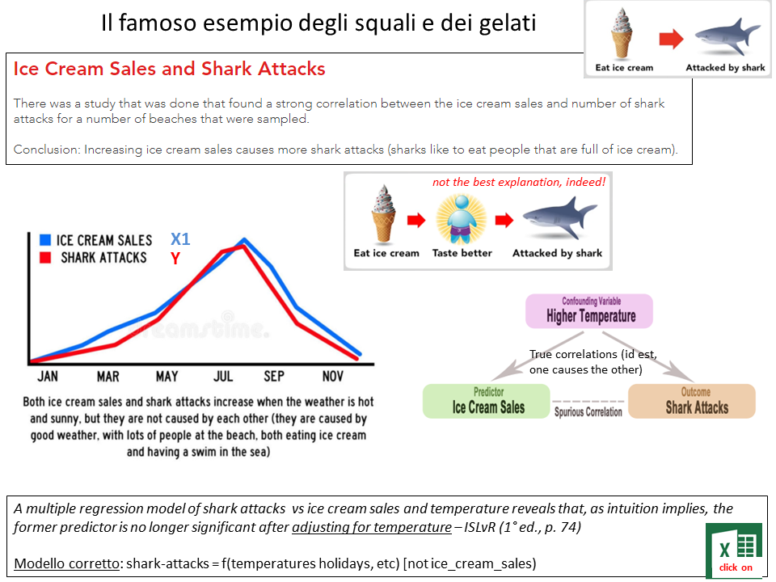
```

Esempi di
[correlazione spuria](https://www.tylervigen.com/spurious-correlations).<br>

Limiti della correlazione di Pearson.

```{r limiti_corr, echo=FALSE, out.width="50%", fig.cap="A nice image."}
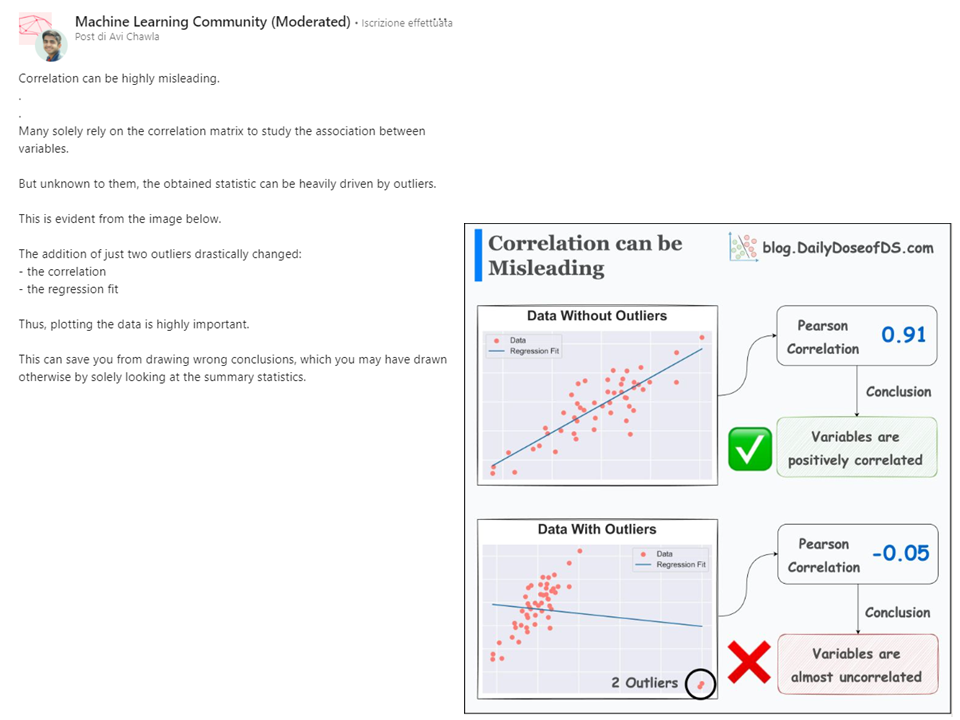
```

```{r immagine29, echo=FALSE, out.width="50%", fig.cap="A nice image."}
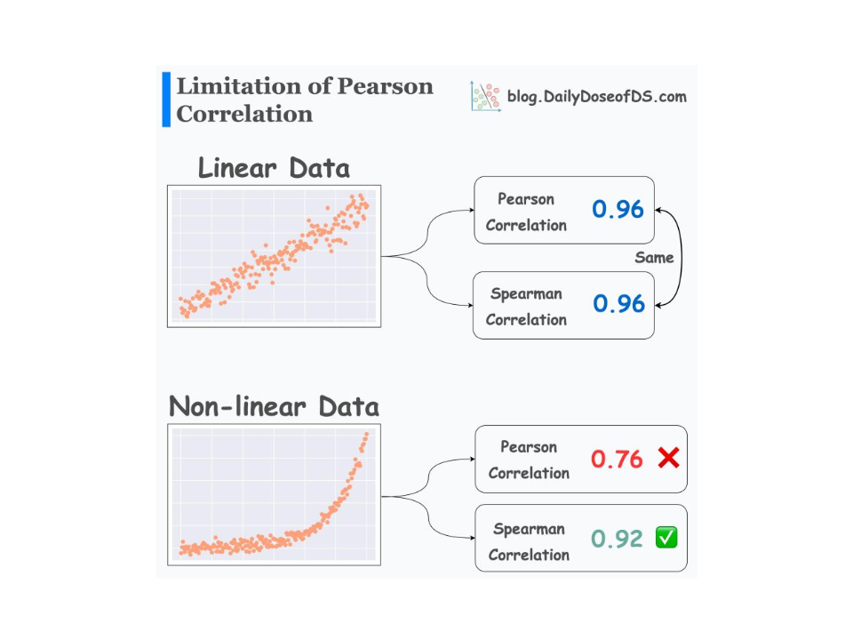
```

Regola pratica: siccome la correlazione è, per definizione, tra due variabili,
possiamo sempre fare lo scatterplot. In base alla **forma** della eventuale
relazione (lineare oppure non-lineare, cioè quadratica, esponenziale,
sinusoidale, ecc) possiamo scegliere quale tipo di correlazione scegliere; in
particolare, se quella di Pearson o quella di Spearman.<br>

**Domanda fondamentale**: quando calcoliamo una statistica campionaria (la
media, la varianza, la correlazione), essa è appunto per definzione basata sul
campione disponibile. Questo campione è: 1. sufficientemente grande? 2. è
rappresentativo della realtà? (cioè, non è *biased*).<br> Il modo principale per
rispondere a queste domande è di eseguire un **test di ipotesi**. Ad esempio,
per la correlazione:

```{r test_corr}
cor.test(X.1,X.2,conf.level = 0.99,)
```

Siccome il p.value è nettamente inferiore al 5% (0.05) - nei PC attuali a doppia
precisione 10\^-16 è praticamente 0 -, possiamo affermare che NON si può NON
rifiutare l'ipotesi nulla (H0), cioè che tra le due variabili X.1 e X.2 non ci
sia correlazione.

NB. Il test di ipotesi si limita a affermare che, con questo campione ed a
questo livello di significatività 1-alpha, esiste nella popolazione una
correlazione significativamente differente da zero. Nulla ci dice sulla
"magnitudo", cioè l'intensità della correlazione: è da considerarsi "forte"
oppure no?

```{r immagine30, echo=FALSE, out.width="50%", fig.cap="A nice image."}
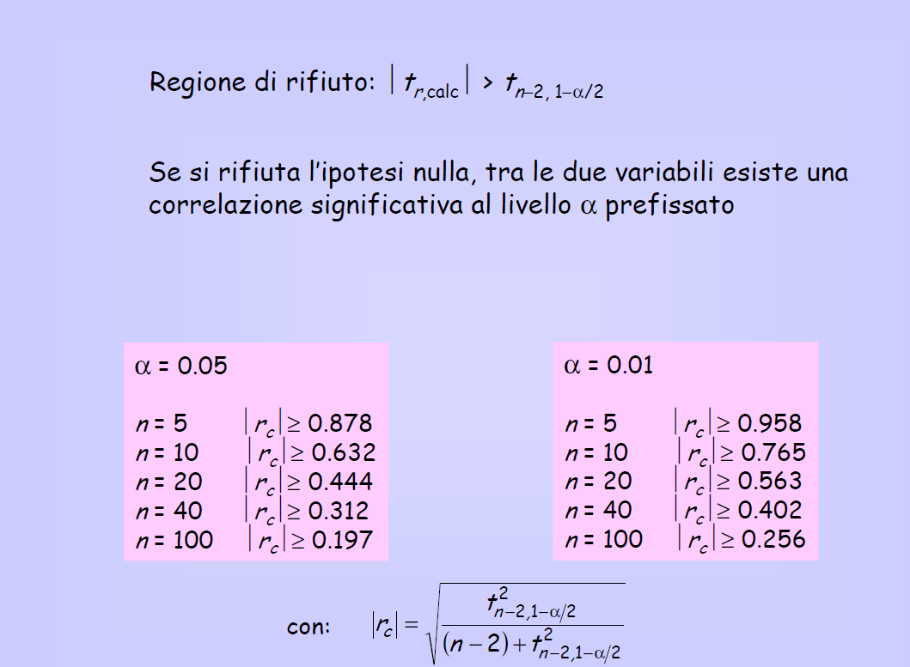
```

# La matrice di correlazione

```{r corr_matrix}
var.num <- c("Income","Limit","Rating","Cards","Age","Education","Balance")
round(cor(Credit[var.num]),2)              # matrice di correlazione (difficile visivamente da controllare!)
```

Esistono in R ottime funzioni per visualizzare efficacemente la matrice di
correlazione.

```{r corrplot, eval=FALSE}
library(corrplot)
corrplot(cor(Credit[var.num]),type="upper",method="ellipse")
                                             # la matrice di correlazione è sempre SIMMETRICA, per definizione,
                                             # cioè se si scambiano righe e colonne si ottiene la stessa identica matrice;
                                             # dunque è sufficiente visualizzare la matrice triangolare superiore
                                             # (od inferiore).
                                             # più l'ellisse è allungata maggiore è l'intensità della correlazione.
# si vede una fortissima correlazione tra 'Limit' e 'Rating' ed una forte tra 'Balance' e 'Limit'
cor(Credit$Limit,Credit$Rating)   # 0.99!
cor(Credit$Limit,Credit$Balance)  # 0.86
```

3 errori tipici nell'uso di questa funzione grafica:

```{r errori_tipici, eval=FALSE}
# 1) x11 è rimasto aperto (cioè non avete fatto 'dev.off()') --> il nuovo grafico è visualizzato nel device grafico x11

# 2)
# corrplot(Credit)           # la correlazione tra 2 variabili categoriche (o tra una variabile categorica ed una numerica) non ha senso.

# 3)
# corrplot(Credit[var.num])
# si deve applicare la funzione 'corrplot' alla matrice delle correlazioni, non al dataframe originale!
```

Un'alternativa al "correlation plot" è il "correlation gram", in italiano
"correlogramma" (stesso scopo):

```{r corrgram}
library(corrgram)
corrgram(Credit[var.num],order=T,lower.panel=panel.shade,upper.panel=panel.pie,main="Correlation gram di Credit")
                   # la parte bassa si interpreta così:
                   # - una cella blu con diagonali dal basso all'alto indica correlazione positiva;
                   # - una cella rossa con diagonali dall'alto al basso indica correlazione negativa;
                   # - l'intensità del colore (rosso o blu) indica l'intensità della correlazione (da 0 a 1, oppure da 0 a -1);
                   #   la parte alta si interpreta così:
                   # - l'intensità della correlazione è data sia dal colore che dalla dimensione della fetta colorata
```

Vediam ora un esempio APPLICATIVO (finanziario) dell'utilità pratica delle
correlazioni (dal libro "[Statistic\@online](mailto:Statistic@online){.email}"
di Bollani e Bottacin, p. 206)

```{r esempio_finanziario, eval = FALSE}
library("openxlsx") # fornisce la funzione 'read.xlsx' (non disponibile in R base)
# per la lettura in R di file excel vedi:
url <- "https://www.r-bloggers.com/2021/06/reading-data-from-excel-files-xlsxlsxcsv-into-r-quick-guide/"
# browseURL(url, browser = getOption("browser"))

# data <- read.xlsx(xlsxFile = "Correlazione.xlsx")
data <- read.csv("Correlazione.csv", sep=";")
data
# i dati sui REATI di riciclaggio scoperti e denunciati nel 2016 sono forniti dall'ISTAT.
# i dati degli SPORTELLI nel 2016 sono forniti da Banca d'Italia,
# i dati sul numero di segnalazioni di operazioni sospette (SOS) nel 2016 sono forniti dalla UIF (Unità di Informazione
# Finanziaria)
# X = reati / sportello: numero medio per sportello di reati di riciclaggio denunciati nel 2016
# Y = SOS / sportello: numero medio per sportello di SOS nel 2016

dim(data)
str(data)
if (interactive()) {
  View(data)
}


cor(data$X,data$Y)   # --> 0.68
                     #     cioè nel 2016 c'è stata una correlazione positiva tra reati denunciati (per sportello)
                     #     e SOS (per sportello); ciò conferma che, se la correlazione è confermata negli anni
                     #     successivi, le SOS sono uno strumento efficace nell'anti-riciclaggio.

plot(data$X,data$Y)  # lo scatterplot, in questo caso, fornisce un'evidenza inferiore della associazione 

```

# L'inferenza

```{r immagine31, echo=FALSE, out.width="50%", fig.cap="A nice image."}
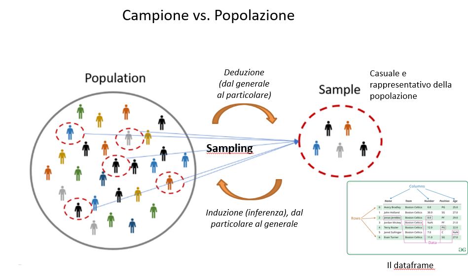
```

Le due tipiche procedure di inferenza sono il test di ipotesi ed il calcolo
dell'intervallo di confidenza, due lati della stessa medaglia e perciò spesso
implementati dalla stessa funzione. Vediamoli per la media campionaria.

## Il test/IC della media campionaria

```{r test_MC}
X <- Credit$Income
mean(X)

mu = 41 # da esperienze / conoscenze pregresse

# In la funzione per il TH/IC è
t.test(x=X,mu = mu,conf.level = .95)  # H0: mu=41
```

pvalue \< 0.05 --\> devo rifiutare H0, ed infatti l'IC NON contiene mu=41.

```{r test_MC_99}
t.test(x=X,mu = mu,conf.level = .99)  # H0: mu=41
```

41 ora è incluso nell'IC, ed infatti devo accettare H0 perchè il pvalue è
superiore al nuovo alpha (0.01)

L'output è strutturalmente identico a quello del test di correlazione visto
prima.<br> La formula dell'IC della media è la seguente:

L'IC è relativo alla media della **popolazione**, ed è costruito in modo
ancorato alla media **camnpionaria**, come si vede dalla seguente formula:<br>

$\bar{X}_n \pm t_{1-\alpha/2}(n - 1) \frac{S}{\sqrt{n}}$<br>

Come utile esercizio, proviamo a calcolare esplicitamente l'IC della X prima
vista e vedere se otteniamo lo stesso IC ottenuto con la funzione `t.test`.

```{r IC}
S <-  sd(X)
n <-  length(X)
alpha <- 0.05
qt <- qt(1-alpha/2, df=n-1)   
I.alpha <- qt*S/sqrt(n)
mean(X) + c(-1,1)*I.alpha     # trucco di programmazione: si sfrutta il funzionamento di vettoriale 
                              # di R per visualizzare l'IC con un solo comando
```

Esistono vari tipi di test: - test della varianza - test di Fisher - test di
gaussianità

Vediamo un altro tipo di test, quello distribuizionale:

```{r test_gauss}
# il test di gaussianità
library(tseries)
jarque.bera.test(X)
```

L'IC NON è ovviamente qui fornito, perchè un test di gaussianità è un test di
ipotesi su una distribuzione, non su una statistica campionaria. H0 - la
variabile X sottoposta a test è gausssiana - non può essere accettata perchè il
pvalue è bassissimo (inferiore a qualunque plausibile livello di alpha)

# La dipendenza tra variabili categoriche

Esiste una misura di **dipendenza** analoga alla correlazione, ma applicabile
alle variabili categoriche

```{r chisquare_test}
str(Credit)
# cor(Credit$Married,Credit$Student) # non applicabile

chisq.test(Credit$Married,Credit$Student)
```

In questo test, H0: le due variabili sono indipendenti, cioè chi-square = 0.
Poichè H0 \>\> qualsiasi alpha significativo (0.01,0.05,0.10), debbiamo
accettare Ho, e quindi concludere che non c'è una dipendenza tra le due
variabili. Per valutare la magnitudo di questa dipendenza occorrono gli
"odds-ratio".

# Statistiche/funzioni su due variabili categoriche

```{r stats_due_var}
X <- Credit$Married
Y <- Credit$Student
```

Vediamo alcune funzioni, grafici e test di ipotesi

```{r addmargins}
# cov(X,Y)             # --> NO!
table(X,Y,useNA = "ifany")           # tabella a doppia entrata (two-way table);
                                     # è una tabella di contingenza a 4 valori (aka, tetracorica - Wikipedia)
                                     # ['useNA = "ifany"' rimuove eventuali MV]
addmargins(table(X,Y))
addmargins(table(X,Y),FUN="min")    # la colonna margine può riportare varie funzioni (vedi help)
```

```{r plot_esempio}
plot(X,Y)
```

Il test chi-quadrato di Pearson.<br> Se due eventi sono indipendenti, la loro
frequenza CONGIUNTA è il prodotto delle frequenze MARGINALI.<br> H0:
indipendenza; se accetto H0, sono indipendenti (p.val alto per qualsiasi
alpha).<br> Non dà l'intensità della eventuale dipendenza, come invece fa la
correlazione (servono altre tecniche, come gli "odds ratio").

```{r test_chisquare2}
chisq.test(X,Y)
```

Sul test chi-quadrato vedi il seguente esempio.

```{r immagine32, echo=FALSE, out.width="50%", fig.cap="A nice image."}
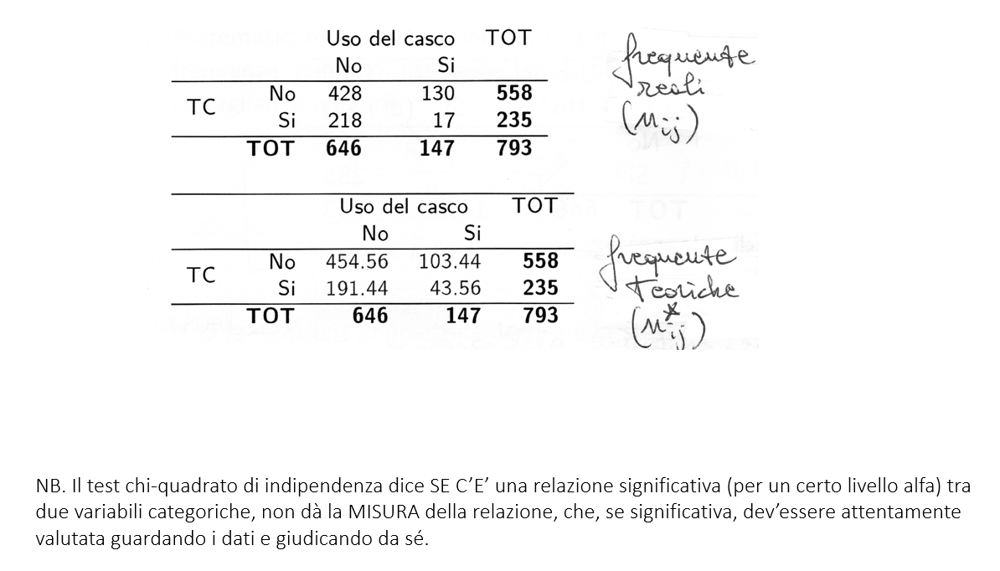
```

Un'alternativa alla correlazione per le variabili categoriche è la
cross-tabulazione (Jank):

```{r cross-tabulazione, eval = FALSE}
library(gmodels)
CrossTable(X,Y)                      # cell contents in alto:
                                     # N: frequenza congiunta assoluta
                                     # N/Table Total: frequenza congiunta relativa
                                     # "chi-square distribution" è il contributo di quella cella al valore della statistica chi-square.
                                     # N/Row Total e N/Col Total sono le frequenze condizionate; non confonderle con le
                                     # frequenze marginali (riportate sui totali di colonna e di riga):

url <- "http://progettomatematica.dm.unibo.it/StatisticaDescrittiva/StatisticaDescrittiva/cap5.html"
# browseURL(url, browser = getOption("browser"))

library(vcd)
assocstats(table(X,Y))               # l'intensità della dipendenza, misurata con 3 differenti "indici di connessione";
                                     # qui indici bassi.
                                     # il termine "indice di connessione" è dello statistico italiano Corrado Gini.
                                     # la connessione è concetto ampio, adattabile anche a due variabili numeriche;
                                     # poichè tuttavia le variabili numeriche possono essere ordinate, si può
                                     # calcolarne media e deviazioni, ecc, si preferisce calcolarne la correlazione
                                     # (anzichè appunto la connessione).
                                     # per il calcolo degli indici di connessione (ad es. il chi-quadro) --> vedi prossimo corso

```

# Statistiche su due variabili (una numerica ed una categorica)

```{r stats_variabili_miste, eval = FALSE}
X <- Credit$Income   # variabile numerica continua
Y <- Credit$Student
# cov(X,Y)             # --> NO!
# cor(X,Y)             # --> NO!

plot(X,Y)

# --> boxplot appaiati ed ANOVA (prof. Tardella, La Sapienza, 2-a giornata)
```

# Funzioni su tre variabili categoriche

```{r tre_var_cat, eval = FALSE}
X <- Credit$Region
Y <- Credit$Student
Z <- Credit$Married
table(X,Y,Z)                         # frequenze congiunte
```

# Funzioni sinottiche (agiscono su ALCUNE/TUTTE le colonne)

Medie delle varie colonne

```{r funzioni_vettoriali}
my.vars <- c("Income","Age","Education","Balance")
colMeans(Credit[my.vars])
```

Boxplot appaiati.

```{r boxplot_affiancati}
par(mfrow=c(2,2))
boxplot(Credit[my.vars])         # sd troppo diverse tra loro:
apply(Credit[my.vars],2,sd)
boxplot(scale(Credit[my.vars]))  # sd ora confrontabili, perchè dati riscalati
```

GGally

```{r ggally_2}
library(GGally)
ggpairs(Credit[my.vars]) # output molto informativo
```

Statistiche di `Hmisc`

```{r stats_Hmisc}
# library(Hmisc)
describe(Credit[my.vars])
```

# Relazioni tra 3+ variabili categoriche ((RIA, 2nd ed., p. 276-278))

```{r relazioni_var_cat}
library(vcd)
my.var <- c("Education","Married","Student")
ftable(Credit[my.var])  # --> l'output è ordinato secondo il vettore di variabili fornito
```

Il grafico mosaic:

```{r mosaic}
mosaic(~Education+Student+Married,data=Credit,shade=T,legend=T)
```

Applichiamo questo grafico ad un famoso dataset 'Titanic', poi torneremo al
dataset Credir:

```{r titanic}
str(Titanic)   # --> fornisce il numero di passeggeri sovravvissuti o morti, cross-classificati per Classe (1-a, 2-a, 3-a,
               #     equipaggio), sesso (uomo, donna), età (adulto, bambino).
mosaic(Titanic,shade = T)
```

Interpretazione del grafico: - deduzioni dal grafico (si devono considerare le
altezze RELATIVE a sx, a dx, in basso ed in alto): - l'equipaggio era il più
numeroso, seguito dalla terza classe; la prima classe era la meno numerosa; -
l'equipaggio era composto in grande maggioranza da uomini e praticamente tutto
da adulti (tranne poce eccezioni);le classi con più bambini erano la terza e la
seconda, quella con più donne la prima; - la maggior quantità di deceduti si è
avuta tra l'equipaggio, che si è evidentemente molto sacrificato, ed a
decrescere in base alla classe: i più ricchi si sono salvati in maggior
numero; - donne e bambini si sono salvati molto più degli uomini, como noto
dalle cronache, ma comunque di più nelle classi alte (prima e seconda) - il
colore BLU indica che quella cross-classificazione è risultata più numerosa di
quello che ci si sarebbe potuto attendere se le variabili fossero indipendenti;
il colore ROSSO, all'oppopsto, indica che quella cross-classificazione è
risultata meno numerosa di quello che ci si sarebbe potuto attendere se le
variabili fossero indipendenti.

```{r}
example(mosaic)  # vari possibili layout con differenti dataset
```

Ora esaminiamo nuovamente il grafico mosaic per i dati categorici di 'Credit':

```{r mosaic2}
mosaic(~Education+Married+Student,data=Credit,shade=T,legend=T)
               # --> l'assenza di colori ci testimonia che le frequenze osservate sono abbastanza vicine a quelle che avremmo
               #     con variabili indipendenti. Confermato dalle altezze relative.
```

# Statistiche mancanti di R base

```{r stats_mancanti}
# statistiche mancanti in R base ------------------------------------------

# MODA (da Università La Sapienza):

# per variabili numeriche.

Mode=function(x,tie.choice=c("all","first","random"),message=F) {

  if(!(is.vector(x)|is.factor(x))) stop("x is neither a vector nor a factor!!")

  ux=unique(x)
  tab=tabulate(match(x, ux))
  out.complete=ux[which(tab==max(tab))]
  out = switch(tie.choice[1],
               all = out.complete,
               first = sort(out.complete)[1],
               random = sample(out.complete)[1]
  )
  if(message==T){
    attr(out,"uniqueness")="yes"
    if(length(out.complete)>1){
      attr(out,"uniqueness")="no"
    }
  }
  return(out)
}

# SKEWNESS e KURTOSIS (da RIA, 2nd ed. pp. 139-140):

mystats <- function(x,na.omit=FALSE) {
  if(na.omit)
    x <- x[!is.na(x)]
  m <- mean(x)
  n <- length(x)
  s <- sd(x)
  skew <- sum((x-m)^3/s^3)/n
  kurt <- sum((x-m)^4/s^4)/n - 3
  return(c(n=n,mean=m,sd=s,skew=skew,kurtosis=kurt))
}


```

# Grafica in R

## Funzioni grafiche di una variabile numerica

```{r funzioni_1_var, eval=FALSE}
par(mfrow=c(1,2)) # divide la finestra in due
boxplot(X,outline = T)        # --> la distribuzione campionaria, con varie evidenze.

url <- "https://quantgirl.blog/anatomy-of-a-box-plot/"
# browseURL(url, browser = getOption("browser"))   # l'utilità del boxplot e come interpretarlo

# uno dei vari scopi del boxplot è di vedere gli outlier;
# cos'è un outlier? varie definizioni: in statistica descrittiva è un'osservazione ai limiti del range di valori;
# ad esempio:
c(quantile(X,0.25)-1.5*IQR(X),quantile(X,0.75)+1.5*IQR(X)) # un outlier è oltre Q1-1.5*IQR e Q3+1.5*IQR
c(mean(X)-3*sd(X),mean(X)+3*sd(X))                         # un outlier è oltre -3sigma e + 3sigma (più conservativo)

hist(X)           # distribuzione assimmetrica (non gaussiana)
par(mfrow=c(1,1)) # restore del layout grafico UNICO
# --> presenza di outlier (confermati) e non-gaussianità IMPEDISCONO l'applicazione di diversi metodi di Machine Learning.
# [more on outlier è nel corso R avanzato]

# Income è gaussiana?
shapiro.test(X)   # test di gaussianità --> no, X NON è gaussiana (perchè p.value < 0.5)
                  # 2.2 * 10^-16 = 0 del computer a doppia precisione

par(mfrow=c(1,2))
hist(X,breaks = 30)
# come gaussianizzare X?
X.log <- log(X)               # compatta il range e rende la distribuzione più simmetrica
hist(X.log,breaks = 30)       # molto più simmetrica!
shapiro.test(X.log)           # il test è molto sensibile, rifiuta perchè X NON è proprio gaussiana

par(mfrow=c(1,2))
hist(X,main = "istogramma",breaks = 50)     # frequenze (RILEVATE dal campione)
d <- density(X)                             # la forma
plot(d,main="stima kernel della distribuzione di income");polygon(d,col="red",border="blue");rug(X,col="brown")    
                                            # a sx del min(income) STIMA la forma della funzione
                                            # sovrascrive
                                            # sovrascrive
par(mfrow=c(1,1))
```

## Grafici base in R

```{r grafici_base}
# istogramma
# defining vector
x <- c(21, 23, 56, 90, 20, 7, 94, 12,
    57, 76, 69, 45, 34, 32, 49, 55, 57)
 
# output to be present as PNG file
png(file = "hist.png")
 
hist(x, main = "Histogram of Vector x",
        xlab = "Values",
        col.lab = "darkgreen",
        col.main = "darkgreen")
 
# saving the file
dev.off()
```

```{r scatterplot}
# scatterplot
# taking input from dataset Orange already 
# present in R
orange <- Orange[, c('age', 'circumference')]

# output to be present as PNG file
png(file = "plot.png")

# plotting
plot(x = orange$age, y = orange$circumference, xlab = "Age",
ylab = "Circumference", main = "Age VS Circumference",
col.lab = "darkgreen", col.main = "darkgreen",
col.axis = "darkgreen")


```

```{r sc_matrix}
# scatterplot matrix

# output to be present as PNG file
png(file = "plotmatrix.png")
 
# plotting scatterplot matrix
# using dataset Orange
pairs(~age + circumference, data = Orange,
col.axis = "darkgreen")
 
# saving the file
dev.off()
```

```{r esempio_avanzato}
# boxplot
# defining vector with ages of employees
x <- c(42, 21, 22, 24, 25, 30, 29, 22,
	23, 23, 24, 28, 32, 45, 39, 40)

# output to be present as PNG file
png(file = "boxplot.png")

# plotting
boxplot(x, xlab = "Box Plot", ylab = "Age",
col.axis = "darkgreen", col.lab = "darkgreen")

# saving the file
dev.off()

```

```{r esempio_avanzato_2}
# barplot

# defining vector
x <- c(7, 15, 23, 12, 44, 56, 32)
 
# output to be present as PNG file
png(file = "barplot.png")
 
# plotting vector
barplot(x, xlab = "GeeksforGeeks Audience",
        ylab = "Count", col = "white",
        col.axis = "darkgreen",
        col.lab = "darkgreen")
 
# saving the file
dev.off()
```

```{r torte}
# pie charts
# defining vector x with number of articles
x <- c(210, 450, 250, 100, 50, 90)
 
# defining labels for each value in x
names(x) <- c("Algo", "DS", "Java", "C", "C++", "Python")
 
# output to be present as PNG file
png(file = "piechart.png")
 
# creating pie chart
pie(x, labels = names(x), col = "white",
main = "Articles on GeeksforGeeks", radius = -1,
col.main = "darkgreen")
 

```

```{r torte_3D}

# importing library plotrix for pie3D()
library(plotrix)
 
# defining vector x with number of articles
x <- c(210, 450, 250, 100, 50, 90)
 
# defining labels for each value in x
names(x) <- c("Algo", "DS", "Java", "C", "C++", "Python")
 
# output to be present as PNG file
png(file = "piechart3d.png")
 
# creating pie chart
pie3D(x, labels = names(x), col = "white",
main = "Articles on GeeksforGeeks",
labelcol = "darkgreen", col.main = "darkgreen")
 
# saving the file
dev.off()
```

## Grafica avanzata in R

Meglio da file .R.

```{r grafica_avanzata, eval =FALSE}
# "A picture REALLY can be worth a thousand words".
# "Modern data analysis increasingly relies on graphical presentations to uncover meaning and convey results."
# "The attractive graphycal results/reports can be distributed to stakeholders and the public.

# R offre la grafica di più alta qualità sul mercato.
# Molti dei grafici statistici che vediamo sui giornali sono fatti con R.
# esempio del NYT:
url <- "https://blog.revolutionanalytics.com/2011/03/how-the-new-york-times-uses-r-for-data-visualization.html"
# browseURL(url, browser = getOption("browser"))

# alcune demos (focus deel mouse sulla consolle):
demo(persp)
demo(image)

# alcuni motori grafici di R:
# - base: per grafici statistici, facile da usare; offre grafici predefiniti ed anche custom.
# - package 'lattice': ottimo per dati multivariati; offre grafici predefiniti ed anche custom.
# - package 'ggplot2' (implementa "The Grammar of Graphics" di Wilkinson, scritto da H. Wickham): offre in più grafici attraenti;
#   non è immediato da usare (c'è una grammatica).

# x11(width, height) --> X Window System Graphics
#                        si possono modificare colori, font, background, titoli, ecc (vedi help)

# dati di esempio (dal dataset 'Credit' di ISLR):
library(ISLR)
Credit
str(Credit)
attach(Credit)

# grafici interattivi: 2 funzioni per interagire con i grafici (help R e Verzani, p. 45):
# - A) 'locator': "Returns the position of the graphics cursor (in the "user coordinate system") when the (first) mouse button is pressed;
#   the identification process can be terminated by clicking the second button and selecting ‘Stop’ from the menu, or from the ‘Stop’
#   menu on the graphics window; 'locator' is only supported on screen devices such as X11 and windows.
x11()
n <- 3 # the maximum number of points to locate. Valid values start at 1.
plot(Income,Balance);
if (interactive()) {
  locator(n,type="p")  # locator is only supported on screen devices such as X11
}


# - B) 'identity' reads the position of the graphics pointer when the (first) mouse button is pressed. It then searches the coordinates
#   given in x and y for the point closest to the pointer. If this point is close enough to the pointer, its index will be returned as
#   part of the value of the call".
x11()
plot(Income,Balance); identify(Income,Balance)    # --> visualizza label SUBITO
# oppure (senza x11() aperto):
plot(Income,Balance); identify(Income,Balance)    # --> visualizza label a fine processo (escape)

# attenzione: a volte, se non ben terminati, i grafici interattivi lasciano le finestre x11() aperte che non si riescono
# a chiudere a mano, e nemmeno con dev.off. si deve chiudere RStudio.

# pdf() - "it starts the graphics device driver for producing PDF graphics (R help):
pdf("nome.file.pdf")
plot(Income,Balance);
dev.off()

jpeg("nome.file.jpg")
plot(Income,Balance);
dev.off()

# c'è anche 'bmp', 'png', ecc

# grafici 3D: vari modi:

library(scatterplot3d)
scatterplot3d(Income,Age,Balance)    # 3d prospettico

# --> STATIC plots (like the above one) are convenient if one need to compare (and save) many plots.

library(rgl)
plot3d(Income,Age,Balance)           # vero 3d, interattivo

# --> drawback: when you save it, you cannot set orientation.

# grafici parametrici, cioè con "Gui controls" che permettono di manipolare il grafico (Verzani, pp. 46 / 47):
library(manipulate)
dens <- list("Normal"=rnorm,"Exponential"=rexp)
manipulate(
  {
    # plot expression (when evaluated, it produces the desired plot)
    y <- dens[[distribution]](n)
    plot(density(y,bw=bw,kernel=kernel))
    if(addPoints)
      points(y, rep(0,length(y)))
  },
  # define controls
  n=slider(5,100,initial=10),
  distribution=picker("Normal","Exponential"),
  kernel=picker("gaussian","epanechnikov","rectangular","triangular","cosine"),
  bw=slider(.05,2,initial = 1),
  addPoints=checkbox(TRUE,"Add points")
)

# colori:
colors()  # lista colori, settabile nei plot con l’argomento col=intero del colore.

# argomento 'col' = indice (intero), nome, RGB o HSV
plot(Income,Balance,col="brown");
plot(Income,Balance,col=32);

# indice è utile per plot di sottopolazioni,
# col=as.integer(class-type), dove class-type è il fattore target della classe, che internamente
# da R è sempre memorizzato come intero, anche se i suoi livelli (levels(factor)) sono alfanumerici.

# esempio con iris
iris
str(iris)
attach(iris)
levels(Species)
plot(Sepal.Length,Sepal.Width,col=as.integer(Species),pch=16) # help 'par' --> help 'points' --> 'pch values'

# contour plot e heatmap (ISLR, p. 46-47)
x=seq(1,10)  # piccolo excursus sulle sequenze:
x
x=1:10
x
x=seq(-pi,pi,length=50)
y=x
f=outer(x,y,function(x,y)x^2+y^2)        # per ogni punto della griglia (X,Y) questa funzione calcola X^2+Y^2
                                         # su una terza dimensione.
persp(x,y,f)                             # ecco la funzione (convessa)

contour(x,y,f)                           # ed ecco le sue curve di livello (come nelle cartine topografiche);
                                         # i valori più bassi di f sono al centro (funzione convessa)
contour(x,y,f,nlevels=45,add=T)
image(x,y,f)                             # 'image' è come 'contour', ma a colori (heatmap); spesso usata per
                                         # plottare le temperature nelle previsioni del tempo

# attenzione:
contour(Income,Balance,Age)              # --> non ha senso (la terza dimensione non è funzione delle prime due)


```

# Distribuzioni di probabilità

```{r immagine33, echo=FALSE, out.width="50%", fig.cap="A nice image."}
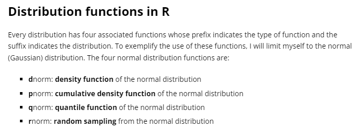
```

**dnorm**

```{r dnorm}
#find the value of the standard normal distribution pdf at x=0
dnorm(x=0, mean=0, sd=1)
# [1] 0.3989423

#by default, R uses mean=0 and sd=1
dnorm(x=0)
# [1] 0.3989423

#find the value of the normal distribution pdf at x=10 with mean=20 and sd=5
dnorm(x=10, mean=20, sd=5)
# [1] 0.01079819

#Create a sequence of 100 equally spaced numbers between -4 and 4
x <- seq(-4, 4, length=100)

#create a vector of values that shows the height of the probability distribution
#for each value in x
y <- dnorm(x)

#plot x and y as a scatterplot with connected lines (type = "l") and add
#an x-axis with custom labels
plot(x,y, type = "l", lwd = 2, axes = FALSE, xlab = "", ylab = "")
axis(1, at = -3:3, labels = c("-3s", "-2s", "-1s", "mean", "1s", "2s", "3s"))
```

**pnorm**

```{r pnorm}
#find percentage of males that are taller than 74 inches in a population with
#mean = 70 and sd = 2
pnorm(74, mean=70, sd=2, lower.tail=FALSE)

# [1] 0.02275013

#find percentage of otters that weight less than 22 lbs in a population with
#mean = 30 and sd = 5
pnorm(22, mean=30, sd=5)

# [1] 0.05479929

#find percentage of plants that are less than 14 inches tall, then subtract the
#percentage of plants that are less than 10 inches tall, based on a population
#with mean = 13 and sd = 2
pnorm(14, mean=13, sd=2) - pnorm(10, mean=13, sd=2)

# [1] 0.6246553
```

**qnorm**

```{r qnorm}
#find the Z-score of the 99th quantile of the standard normal distribution 
qnorm(.99, mean=0, sd=1)
# [1] 2.326348

#by default, R uses mean=0 and sd=1
qnorm(.99)
# [1] 2.326348

#find the Z-score of the 95th quantile of the standard normal distribution 
qnorm(.95)
# [1] 1.644854

#find the Z-score of the 10th quantile of the standard normal distribution 
qnorm(.10)
# [1] -1.281552
```

**rnorm**

```{r rnorm}
#generate a vector of 5 normally distributed random variables with mean=10 and sd=2
five <- rnorm(5, mean = 10, sd = 2)
five
# [1] 10.658117 8.613495 10.561760 11.123492 10.802768

#generate a vector of 1000 normally distributed random variables with mean=50 and sd=5
narrowDistribution <- rnorm(1000, mean = 50, sd = 15)

#generate a vector of 1000 normally distributed random variables with mean=50 and sd=25
wideDistribution <- rnorm(1000, mean = 50, sd = 25)

#generate two histograms to view these two distributions side by side, specify
#50 bars in histogram and x-axis limits of -50 to 150
par(mfrow=c(1, 2)) #one row, two columns
hist(narrowDistribution, breaks=50, xlim=c(-50, 150)) 
hist(wideDistribution, breaks=50, xlim=c(-50, 150))
```

# Regressione

```{r immagine34, echo=FALSE, out.width="50%", fig.cap="A nice image."}
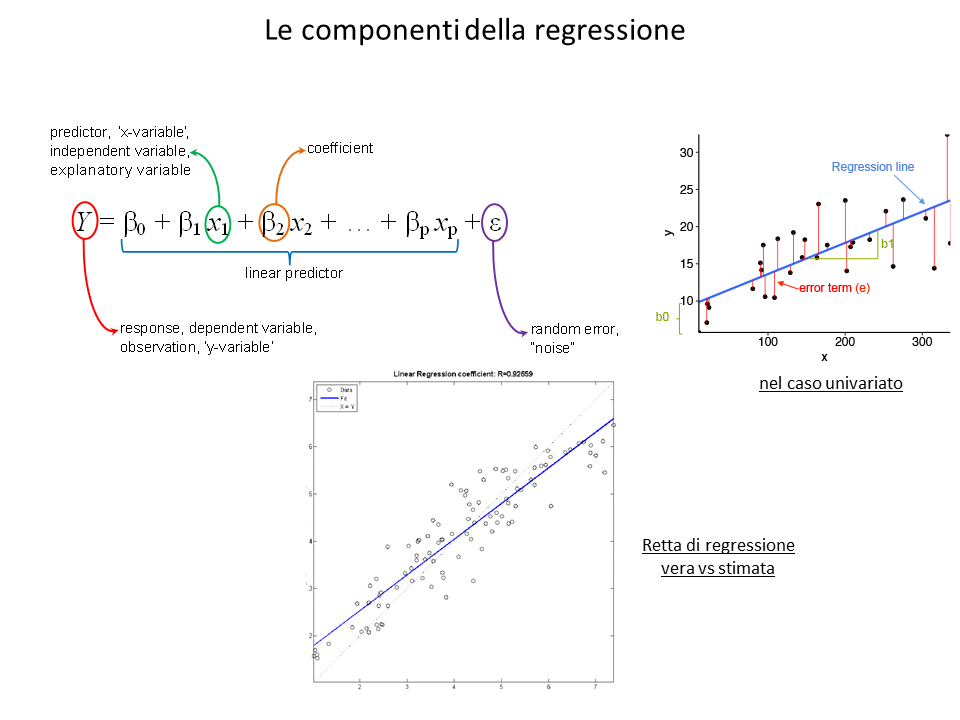
```

Vedi anche [questa](https://setosa.io/ev/ordinary-least-squares-regression/)
bella animazione.

```{r animazione_regressione, eval = FALSE}
attach(Credit)
plot(Balance,Limit)
cor(Balance,Limit)

# scelta della risposta e dei predittori
str(Credit)

mod <- lm(Balance~.-ID,data=Credit)
mod

# il balance di un cliente, ad esempio il client1 1, sarà stimato in questo modo:
# -479.2079 + (X1.value=14.891*-7.80) + (X2.value=3606*0.1909) + () ecc
Credit[1,]
```

```{r fit_mod_regressione}
# esame del modello:

fitted(mod)[1:10]          # le y previste, cioè i Balance previsti
                           # per il cliente 1, il vero Balance è 333, quello previsto dal modello è 418, 
                           # lo scarto (il residuo)è dato dalla loro differenza, cioè 333-418 = -85

residuals(mod)[1:10]       # i residui
coef(mod)                  # i coefficienti (già visti prima) - le loro stime PUNTUALI
confint(mod,level = 0.95)  # gli IC dei vari coefficienti - le loro stime INTERVALLARI

```

Esame del modello più in dettaglio:

```{r esame_regressione}
summary(mod)

# check dei residui (gaussiani? a media 0?)
summary(residuals(mod))
hist(residuals(mod))

```

Per ogni riga, cioè per ogni coefficiente del modello, la funzione `lm()` esegue
un *test t* e determina il pvalue e l'IC.<br>

Manca un elemento di valutazione del modello (tra quelli principali): la **bontà
di adattamento**, che è misurata dal coefficiente **R quadro aggiustato**. E' un
numero tra 0 ed 1. Più vicino ad 1 esso è, migliore è il modello.<br>

```{r R2}
names(summary(mod))
summary(mod)$adj.r.squared
```

Utilizzando i valori dei pvalue del sommario possiamo, in modo iterativo,
escludere via via i predittori non significativi. Non ci sarà effetto sull'R2
aggiustato.

```{r semplifica_modello, eval = FALSE}
summary(mod)

# escludiamo Education:
mod1 <- lm(Balance~.-ID-Education, data=Credit)
summary(mod1)

# escludiamo Ethnicity:
mod2 <- lm(Balance~.-ID-Education-Ethnicity, data=Credit)
summary(mod2)

# escludiamo Married:
mod4 <- lm(Balance~.-ID-Education-Ethnicity-Married, data=Credit)
summary(mod4)

# escludiamo Gender:
mod5 <- lm(Balance~.-ID-Education-Ethnicity-Married-Gender, data=Credit)
summary(mod5)
```

Il modello 5 è il miglior modello con i dati disponibili.<br> Se adesso
togliessimo a questo modello "ristretto" altri predittori, ciò andrebbe a
scapito dell'R2.

```{r modello_magro, eval = FALSE}
mod6 <- lm(Balance~.-ID-Education-Ethnicity-Married-Gender-Income, data=Credit)
summary(mod6)
```

Ultima curiosità: l'R2 è nient'altro che la correlazione al quadrato delle Y
previste e delle Y effettive.

```{r legame, eval = FALSE}
# il vettore delle Y effettive:
y.actual <- Credit$Balance

# il vettore delle Y previste:
y.fitted <- fitted(mod5)

summary(mod5)$r.squared
cor(y.actual,y.fitted)^2
```

Il modello serve a due cose: - spiegare: quali predittori impattano sulla
risposta - prevedere: la risposta per nuove righe

```{r previsioni, eval = FALSE}
# previsione di 3 nuovi valori:
ID <- c(401,402,403)
Income <- c(30,40,50)
Limit <- c(3000,5000,4000)
Rating <- c(350,340,270)
Cards <- c(2,3,1)
Age <- c(18,76,45)
Education <- c(15,14,12)
Gender <- c("Female","Male","Male")
Gender <- factor(Gender,levels = c("Male","Female"))
Student <- c("No","Yes","No")
Student <- factor(Student)
Married <- c("No","Yes","No")
Married <- factor(Married)
Ethnicity <- c("African American","Asian","Caucasian")
Ethnicity <- factor(Ethnicity)


X.new <- data.frame(
  ID,Income, Limit, Rating,Cards, Age, Education,Gender,Student,Married,Ethnicity
)

dim(X.new)
str(X.new)
str(Credit)
summary(mod)

predict(object = mod,newdata = X.new)
```

# Varie

## Debug

Fare **debug in R / RStudio** significa capire passo-passo dove il codice si comporta in modo inatteso. In R esistono strumenti solidi e “classici” che, se usati bene, permettono un controllo molto preciso.

Ti riassumo i metodi fondamentali, partendo da quelli più tradizionali.

---

1️⃣ `browser()` – Il metodo più diretto

Inserisci `browser()` dentro la funzione nel punto che vuoi ispezionare.

```r
mia_funzione <- function(x) {
  y <- x * 2
  browser()
  z <- y + 5
  return(z)
}

mia_funzione(10)
```

Quando l’esecuzione arriva a `browser()`:

* puoi digitare il nome delle variabili (`y`)
* eseguire istruzioni R
* usare comandi:

  * `n` → next (passo successivo)
  * `c` → continue
  * `Q` → esci

È il metodo più affidabile e controllato.

---

`debug()` – Debug completo di una funzione

```r
debug(mia_funzione)
mia_funzione(10)
```

R entra automaticamente in modalità step-by-step.

Per disattivarlo:

```r
undebug(mia_funzione)
```

---

`debugonce()` – Solo una volta

Utile quando vuoi evitare di lasciare la funzione in modalità debug.

```r
debugonce(mia_funzione)
mia_funzione(10)
```

---

4️⃣ `traceback()` – Dopo un errore

Se ottieni un errore:

```r
Errore in ... 
```

Subito dopo esegui:

```r
traceback()
```

Ti mostra la catena delle chiamate che ha portato all’errore.

È il primo strumento da usare quando qualcosa va storto.

---

5️⃣ `options(error = recover)` – Metodo avanzato

Imposta R in modo che, quando si verifica un errore, ti permetta di entrare nel contesto della funzione che ha generato il problema.

```r
options(error = recover)
```

Quando accade un errore, puoi scegliere lo stack frame da ispezionare.

Per tornare al comportamento normale:

```r
options(error = NULL)
```

---

🔵 Debug in RStudio (interfaccia grafica)

RStudio offre strumenti più comodi:

✔ Breakpoint

Clicca a sinistra del numero di riga → pallino rosso
Poi esegui la funzione → si ferma lì.

✔ Step Into / Step Over

Barra strumenti:

* Step Into
* Step Over
* Continue

✔ Environment Pane

Vedi tutte le variabili aggiornate in tempo reale.

---

📌 Strategia tradizionale ed efficace

Quando devi fare debug serio:

1. Riproduci l’errore con il caso più piccolo possibile.
2. Usa `traceback()`.
3. Inserisci `browser()` nel punto sospetto.
4. Se necessario attiva `options(error = recover)`.

Questo approccio, semplice e metodico, è spesso più robusto di soluzioni “automatiche”.

---


## Sequenze ed intervalli

```{r seq_range}
1:10
seq(1,10.2)
range(1:10)
```

## Dimensioni

```{r dimensioni}
length(vet)
dim(df)
dim(array2)
```

## Significato delle parentesi

-   () per funzioni e metodi
-   [] per vettori, matrici, array, dataframe
-   {} per corpo codice

## Cicli ed if

```{r cicli, eval= FALSE}
# discretizzazione di 'Balance' (0,1,2): esempio di 'for' esterna con dentro due 'if-then-else' annidate.
# Attenzione alle parentesi (graffe) aperte e chiuse.

data(Credit)
for (i in 1:nrow(Credit)) {

  if (Credit$Balance[i]>500) {  # if-then-else esterna

    if (Credit$Balance[i]<1000) {  # if-then-else interna
      Credit$Balance[i] <- 1

    } else { # else della if-then-else interna
      Credit$Balance[i] <- 2

    } # fine if-then-else interna

  } else {  # else della if-then-else esterna
    Credit$Balance[i] <- 0
  } # fine if-then-else esterna

}# fine for

View(Credit$Balance)
table(Credit$Balance)
```

```{r esempio_ciclo}
# ciclo 'for' di confronto con il ciclo della introduzione a python di ISLR
total = 0

for (i in c(3,2,19))
  {
    total = total + i
  }
total
```

## Date ed ore

```{r date_ore}
# da RIA, 2nd ed.,p.79+:
# - una data è in genere inserita come stringa di caratteri.
# - una data in R è invece rappresentata internamente come il numero di giorni dal 1 gennaio 1970. così
#   si possono fare operazioni aritmetiche.
# - la conversione è fatta dalla funzione as.Date().

mydates <- as.Date(c("2007-06-22","2004-02-13")) # the default input format is 'yyyy-mm-dd' ("%Y-%m-%d")

mydates <- as.Date(c("2007-06-22","2004-02-13"),format = "%Y-%m-%d") # è la stessa cosa

# ci sono vari formati, un elenco è qui:
# https://campus.datacamp.com/courses/intermediate-r-for-finance/dates?ex=6

strDates <- c("01/05/1965","08/16/1975")  #  un altro formato (mm/dd/yyyy).
dates <- as.Date(strDates,"%m/%d/%Y")     #  si codifica così.
                                          #  attenzione, Y maiuscola!

myformat <- "%m/%d/%Y"                    # una volta per tutte, e poi usare questo formato in tutte le conversioni

# una volta che la data è nel formato interno (numerico), si può usare tutto l'arsenale di funzioni R
Sys.Date()   # data corrente
date()       # data-ora correnti

# differenze di date in gg.:
startdate <- as.Date("2004-02-13")
enddate <- as.Date("2011-01-22")
days <- enddate-startdate
days

# intervalli di tempo (espressi in secondi, minuti, ore, giorni, o settimane):
today <- Sys.Date()
dob <- as.Date("1980-01-20")  # una data di nascita
difftime(today,dob,units="weeks")
difftime(today,dob,units="days")
difftime(today,dob,units="mins")

# conversione da formato inerno a stringa (il contrario):
as.character(startdate)

if (interactive()) {
  ?help(as.Date)    # more on this topic.
}
# i package 'lubridate' e 'timeDate' hanno molte funzioni per la gestione delle date.

# as.POSIXct() # Verzani p. 19
```

## Caricamento di dati

```{r data_loading, eval=FALSE}
# "Today’s data analysts need to be able to access data from a wide range of sources (mainly, database management systems,
# text files, statistical packages, and spreadsheets)".

# molti modi:
# 1) da tastiera (con edit);
# 2) da codice;
# 3) da file (ASCII con 'read.table', XML con il package 'XML');
# 4) da Excel (il modo migliore è da file csv, con 'read.csv');
# 5) dal web (ad es. con 'url');
# 6) da social media (Twitter, Facebook, ecc) e piattaforme web (Google, Amazon, ecc);
# 7) da/verso DBMS (Oracle, SQL Server, DB2, Access, ecc via ODBC o JDBC);
#    two-way communication (ie, we can also update DBMS data); any valid SQL statement can be run against the DBMS;
# 8) da big data platform (ad es. Hadoop, HDF5, ecc)
# 9) da altri pacchetti statistici (ad es. SPSS, SAS, Stata, ecc)
# 10) 'import dataset' sotto tab 'Environment' funziona male, soprattutto con file .csv (Verzani, p. 16).

# vediamo i primi 5 (gli altri sono out-of-scope per questo corso):

# 1) da tastiera:

my.data <- data.frame(eta=numeric(0),sesso=character(0),peso=numeric(0))
my.data <- edit(my.data)  # assegnazione necessaria
class(my.data)
mode(my.data);typeof(my.data)
dim(my.data)
str(my.data)

# 2) da codice:

my.data.txt <- "
eta sesso peso
25 M 74
30 F 56
18 F 60
"
my.data.txt  # \n: vai a capo
my.data <- read.table(header = T,text=my.data.txt) # restituisce un dataframe.
                                                   # 'write.table' è l'opposto ["prints its required argument x
                                                   # (after converting it to a data frame if it is not one nor a
                                                   # matrix) to a file]
my.data
View(my.data) # no edit
edit(my.data) # sì edit

# 3) da file ASCII:
data<-read.table("edge_file_facebook_matlab v2.txt",header=FALSE)
head(data)

# 4) da excel:
findata<-read.csv("FinancialIndicators.csv",header=TRUE) # il modo migliore
head(findata)
str(findata)
class(findata)

# read.csv2 # "they are (almost) the same functions.The only difference is default parameters." (so 22970091)

# 5) da URL

# read.table(url)   # so: 6299220
```

## Help

```{r help, eval = FALSE}
# A) ricerca ESATTA nelle pagine dell'HELP di R (per: funzioni R, dataset, package base o caricati):
# tab "Help" (con topic e subtopic)
help("lm")
?lm # alternativa
# se il package NON è ancora caricato:
help(rlm,package="MASS")

# B) ricerca FUZZY nelle pagine dell'HELP di R  (cioè quando non si conosce il nome esatto):
apropos("^glm")  # --> molto comodo (Verzani, p. 41); "Getting help with R" (https://www.r-project.org/help.html)
help.search("^glm") # ricerca nei package installati

# C) Google!

help.start()  # --> la pagina inziale dell'help

data()        # --> lista di tutti i dataset disponibili nei package attualmente caricati

if (interactive()) {
  library(help="ISLR") # --> vedi anche Indice (contiene i dataset)
} 
library(ISLR) # --> dataset in più (alcuni dei nostri, per questo corso)

# per RStudio:
url <- "https://support.rstudio.com/hc/en-us"
# browseURL(url, browser = getOption("browser"))

sos::findFn("givens")# http://rfunction.com/archives/2525

search() # Gives a list of attached packages (see library), and R objects, usually data.frames.
```

## Dataset disponibili

```{r dataset, eval = FALSE}
data() # quelli disponibili (coi package caricati)
library(help="carData")   # lista anche dei dataset disponibili (sotto Indice)
library(Car)
data("Duncan")  # load pacchetto (in 'Car')
Duncan          # lista righe del dataset

# utili dataset:
url <- "https://www.kaggle.com/datasets"          # kaggle
# browseURL(url, browser = getOption("browser"))
url <- "http://archive.ics.uci.edu/ml/index.php"  # UCI ML repository
# browseURL(url, browser = getOption("browser"))
```

## Funzioni custom

```{r funzioni_custom, eval=FALSE}
# sintassi: 'nome.funzione(lista argomenti)'
# oppure:   ''nome.funzione()' per funzioni che possono non avere argomenti (ad es. 'dir()' oppure 'ls()').
# nome.funzione (senza parentesi) --> il codice interno della funzione (a volte utile da esaminare)
ls

args(nome.funzione) # Displays the argument names and corresponding default values of a function or primitive
args("ls")

# quasi tutto in R è una funzione
"+"(2,2) # persino gli operatori aritmetici

# definizione della funzione
f <- function (x,y,z=1){
  result <- x + (2*y) + (3*z)
  return(result)               # il valore della funzione.
  # se 'return' non è presente, il valore della funzione è quello assegnato nell'ultimo statement.
}
class(f)
mode(f)
args(f)       # i nomi degli argomenti ed i valori di default (funzione interattiva)
formals(f)    #   "      "       "            "         "     (funzione programmatica)

x             # non riconosciuto, è locale ad f.

# argomenti passati per posizione (in ordine):
f(2,3)        #     "        "     "      "          (e default per z)
f(x=2,y=3)    #     "        "     "  nome-argomento (e default per z)
f(x=2,y=3,z=3)#     "        "     "  nome-argomento (z valorizato)
f(z=3,y=3,2)  # gli argomenti z ed y passati per nome, e R assume che il primo argomento non specificato (3) sia x.
              # gli argomenti passati per nome possono essere in qualsiasi ordine.
              # ciò vale per TUTTE le funzioni R, anche quelle standard (non generate dall'utente).
              mean(na.rm="True",x=sleep$NonD)  # 8.67 come sopra

f(3,3,2)      # 15 non 17!
              
# attenzione: gli argomenti sono sempre passati per valore, non per referenza (puntatore). dunque R ne crea una copia (problema con big data).

# debug: breakpoint su 'result' --> pointing f(2,3,4) a seguire per i 4 casi.
# alternativa: 'cat' dentro la funzione f? non funziona!

# da lab ISLR (ch.3):
LoadLibraries    # not yet
LoadLibraries()  # not yet
LoadLibraries=function(){
  library(ISLR)
  library(MASS)
  print("The libraries have been loaded.")
}
LoadLibraries
LoadLibraries()

# Note:
# - lista argomenti nell'ordine dell'help oppure nomi argomento espliciti (che aiuta anche la comprensione)
# - output: return oppure ultimo assignment

# problemi?
url <- "https://stackoverflow.com/questions/7027288/error-could-not-find-function-in-r"
# browseURL(url, browser = getOption("browser"))
```

## Formattazione decimale

```{r formattazione}
pi
round(pi,2)
options(scipen=99)
options(digits=2)

# la soluzione migliore (so question: 3443687):
format(round(pi, 2), nsmall = 2)
```

## Le funzioni *apply*

```{r apply}
# RIA, 2nd ed. p. 101; Advanced R, p. 205.

# la funzione base 'apply': applica la funzione indicata agli indici di un'array (cioè una lista con soli valori numerici)
var.num <- c("mpg","cylinders","displacement")
out <- apply(Auto[var.num],2,"mean")  # sd, var, min, max, length, range, ecc
out
class(out);mode(out)

# 'lapply': applica una funzione ad una lista
out <- lapply(Auto[var.num],"mean") # non c'è l'indice e produce una lista (della stessa lunghezza delle colonne del dataset)
out
class(out);mode(out)

# 'sapply': è una versione user-friendly di 'lapply' che restituisce un vettore
out <- sapply(Auto[var.num],"mean")
out
class(out);mode(out)
```

## Finestre di RStudio

```{r finestre_RStudio, eval=FALSE}
par(mfrow=c(2,2))  # a vector of the form c(nr, nc)
                   # alternatives: 'layout', 'split.screen'
opar=.....         # per salvare prima i vecchi parametri (da restorare dopo)

data(Credit)
x11(width=10,height=10)              # to open an interactive graphics device
plot(Credit$Balance,Credit$Income)
```

## Package

```{r immagine 40, echo=FALSE, out.width="50%", fig.cap="A nice image."}

```

Vedi il [CRAN](https://cran.r-project.org/web/packages/).

## Il funzionamento vettoriale

```{r funzionamento_vettoriale}
# ["Advanced R" di Hadley Wickham - p. 359 e pp. 366+]
# Esempio:
var.num <- c("Income","Limit","Rating","Cards","Age","Education","Balance")

system.time(colSums(Credit[,var.num]))       # funzionamento vettoriale
system.time(apply(Credit[,var.num],2,sum))   # funzionamento non vettoriale (più lento)
```

## Funzioni matematiche

```{r funzioni_matematiche, eval=FALSE}
# [funzioni matematiche (funzionamento vettoriale)]:
sqrt(X)   # radice quadrata
X^2       # elevamento a potenza
log(X)    # logaritmo
url <- "https://towardsdatascience.com/overview-of-40-mathematical-functions-in-r-4b4e138685ff"
# browseURL(url, browser = getOption("browser"))
# ecc --> vedi anche qualche cheatsheets su google]
```

# Introduzione sintetica ad R (in inglese)

Presa dal libro ISLR.

```{r set_error, echo = FALSE}
knitr::opts_chunk$set(error = TRUE)
```

In this lab, we will introduce some simple `R` commands. The best way to learn a
new language is to try out the commands. `R` can be downloaded from

`http://cran.r-project.org/`

We recommend that you run `R` within an integrated development environment (IDE)
such as `RStudio`, which can be freely downloaded from

`http://rstudio.com`

The `RStudio` website also provides a cloud-based version of `R`, which does not
require installing any software.

## Basic Commands

`R` uses *functions* to perform operations. To run a function called `funcname`,
we type `funcname(input1, input2)`, where the inputs (or *arguments*) `input1`
and `input2` tell `R` how to run the function. A function can have any number of
inputs. For example, to create a vector of numbers, we use the function `c()`
(for *concatenate*). Any numbers inside the parentheses are joined together. The
following command instructs `R` to join together the numbers 1, 3, 2, and 5, and
to save them as a vector named `x`. When we type `x`, it gives us back the
vector.

```{r chunk1}
x <- c(1, 3, 2, 5)
x
```

Note that the `>` is not part of the command; rather, it is printed by `R` to
indicate that it is ready for another command to be entered. We can also save
things using `=` rather than `<-`:

```{r chunk2}
x = c(1, 6, 2)
x
y = c(1, 4, 3)
```

Hitting the *up* arrow multiple times will display the previous commands, which
can then be edited. This is useful since one often wishes to repeat a similar
command. In addition, typing `?funcname` will always cause `R` to open a new
help file window with additional information about the function `funcname()`.

We can tell `R` to add two sets of numbers together. It will then add the first
number from `x` to the first number from `y`, and so on. However, `x` and `y`
should be the same length. We can check their length using the `length()`
function.

```{r chunk3}
length(x)
length(y)
x + y
```

The `ls()` function allows us to look at a list of all of the objects, such as
data and functions, that we have saved so far. The `rm()` function can be used
to delete any that we don't want.

```{r chunk4}
ls()
rm(x, y)
ls()
```

It's also possible to remove all objects at once:

```{r chunk5}
rm(list = ls())
```

The `matrix()` function can be used to create a matrix of numbers. Before we use
the `matrix()` function, we can learn more about it:

```{r chunk6}
if (interactive()) {
  ?matrix
}

```

The help file reveals that the `matrix()` function takes a number of inputs, but
for now we focus on the first three: the data (the entries in the matrix), the
number of rows, and the number of columns. First, we create a simple matrix.

```{r chunk7}
x <- matrix(data = c(1, 2, 3, 4), nrow = 2, ncol = 2)
x
```

Note that we could just as well omit typing `data=`, `nrow=`, and `ncol=` in the
`matrix()` command above: that is, we could just type

```{r chunk8}
x <- matrix(c(1, 2, 3, 4), 2, 2)
```

and this would have the same effect. However, it can sometimes be useful to
specify the names of the arguments passed in, since otherwise `R` will assume
that the function arguments are passed into the function in the same order that
is given in the function's help file. As this example illustrates, by default
`R` creates matrices by successively filling in columns. Alternatively, the
`byrow = TRUE` option can be used to populate the matrix in order of the rows.

```{r chunk9}
matrix(c(1, 2, 3, 4), 2, 2, byrow = TRUE)
```

Notice that in the above command we did not assign the matrix to a value such as
`x`. In this case the matrix is printed to the screen but is not saved for
future calculations. The `sqrt()` function returns the square root of each
element of a vector or matrix. The command `x^2` raises each element of `x` to
the power `2`; any powers are possible, including fractional or negative powers.

```{r chunk10}
sqrt(x)
x^2
```

The `rnorm()` function generates a vector of random normal variables, with first
argument `n` the sample size. Each time we call this function, we will get a
different answer. Here we create two correlated sets of numbers, `x` and `y`,
and use the `cor()` function to compute the correlation between them.

```{r chunk11}
x <- rnorm(50)
y <- x + rnorm(50, mean = 50, sd = .1)
cor(x, y)
```

By default, `rnorm()` creates standard normal random variables with a mean of
$0$ and a standard deviation of $1$. However, the mean and standard deviation
can be altered using the `mean` and `sd` arguments, as illustrated above.
Sometimes we want our code to reproduce the exact same set of random numbers; we
can use the `set.seed()` function to do this. The `set.seed()` function takes an
(arbitrary) integer argument.

```{r chunk12}
set.seed(1303)
rnorm(5)
```

We use `set.seed()` throughout the labs whenever we perform calculations
involving random quantities. In general this should allow the user to reproduce
our results. However, as new versions of `R` become available, small
discrepancies may arise between this book and the output from `R`.

The `mean()` and `var()` functions can be used to compute the mean and variance
of a vector of numbers. Applying `sqrt()` to the output of `var()` will give the
standard deviation. Or we can simply use the `sd()` function.

```{r chunk13}
set.seed(3)
y <- rnorm(100)
mean(y)
var(y)
sqrt(var(y))
sd(y)
```

## Graphics

The `plot()` function is the primary way to plot data in `R`. For instance,
`plot(x, y)` produces a scatterplot of the numbers in `x` versus the numbers in
`y`. There are many additional options that can be passed in to the `plot()`
function. For example, passing in the argument `xlab` will result in a label on
the $x$-axis. To find out more information about the `plot()` function, type
`?plot`.

```{r chunk14}
x <- rnorm(100)
y <- rnorm(100)
plot(x, y)
plot(x, y, xlab = "this is the x-axis",
    ylab = "this is the y-axis",
    main = "Plot of X vs Y")
```

We will often want to save the output of an `R` plot. The command that we use to
do this will depend on the file type that we would like to create. For instance,
to create a pdf, we use the `pdf()` function, and to create a jpeg, we use the
`jpeg()` function.

```{r chunk15}
# pdf("Figure.pdf")
plot(x, y, col = "blue")
# dev.off()
```

The function `dev.off()` indicates to `R` that we are done creating the plot.
Alternatively, we can simply copy the plot window and paste it into an
appropriate file type, such as a Word document.

The function `seq()` can be used to create a sequence of numbers. For instance,
`seq(a, b)` makes a vector of integers between `a` and `b`. There are many other
options: for instance, `seq(0, 1, length = 10)` makes a sequence of `10` numbers
that are equally spaced between `0` and `1`. Typing `3:11` is a shorthand for
`seq(3, 11)` for integer arguments.

```{r chunk16}
x <- seq(1, 10)
x
y <- 1:10
y
z <- seq(-pi, pi, length = 50)
z
```

We will now create some more sophisticated plots. The `contour()` function
produces a *contour plot* in order to represent **three-dimensional data**; it
is like a \***topographical map**. It takes three arguments:

-   A vector of the `x` values (the first dimension),
-   A vector of the `y` values (the second dimension), and
-   A matrix whose elements correspond to the `z` value (the third dimension)
    for each pair of (`x`, `y`) coordinates.

As with the `plot()` function, there are many other inputs that can be used to
fine-tune the output of the `contour()` function. To learn more about these,
take a look at the help file by typing `?contour`.

```{r chunk17}
y <- x
f <- outer(x, y, function(x, y) cos(y) / (1 + x^2))
contour(x, y, f)
contour(x, y, f, nlevels = 45, add = T)
fa <- (f - t(f)) / 2
contour(x, y, fa, nlevels = 15)
```

The `image()` function works the same way as `contour()`, except that it
produces a color-coded plot whose colors depend on the `z` value. This is known
as a *heatmap*, and is sometimes used to plot temperature in weather forecasts.
Alternatively, `persp()` can be used to produce a three-dimensional plot. The
arguments `theta` and `phi` control the angles at which the plot is viewed.

```{r chunk18}
image(x, y, fa)
persp(x, y, fa)
persp(x, y, fa, theta = 30)
persp(x, y, fa, theta = 30, phi = 20)
persp(x, y, fa, theta = 30, phi = 70)
persp(x, y, fa, theta = 30, phi = 40)
```

## Indexing Data

We often wish to examine part of a set of data. Suppose that our data is stored
in the matrix `A`.

```{r chunk19}
A <- matrix(1:16, 4, 4)
A
```

Then, typing

```{r chunk20}
A[2, 3]
```

will select the element corresponding to the second row and the third column.
The first number after the open-bracket symbol `[` always refers to the row, and
the second number always refers to the column. We can also select multiple rows
and columns at a time, by providing vectors as the indices.

```{r chunk21}
A[c(1, 3), c(2, 4)]
A[1:3, 2:4]
A[1:2, ]
A[, 1:2]
```

The last two examples include either no index for the columns or no index for
the rows. These indicate that `R` should include all columns or all rows,
respectively. `R` treats a single row or column of a matrix as a vector.

```{r chunk22}
A[1, ]
```

The use of a negative sign `-` in the index tells `R` to keep all rows or
columns except those indicated in the index.

```{r chunk23}
A[-c(1, 3), ]
A[-c(1, 3), -c(1, 3, 4)]
```

The `dim()` function outputs the number of rows followed by the number of
columns of a given matrix.

```{r chunk24}
dim(A)
```

## Loading Data

For most analyses, the first step involves importing a data set into `R`. The
`read.table()` function is one of the primary ways to do this. The help file
contains details about how to use this function. We can use the function
`write.table()` to export data.

Before attempting to load a data set, we must make sure that `R` knows to search
for the data in the proper directory. For example, on a Windows system one could
select the directory using the `Change dir ...` option under the `File` menu.
However, the details of how to do this depend on the operating system (e.g.
Windows, Mac, Unix) that is being used, and so we do not give further details
here.

We begin by loading in the `Auto` data set. This data is part of the `ISLR2`
library, discussed in Chapter 3. To illustrate the `read.table()` function, we
load it now from a text file, `Auto.data`, which you can find on the textbook
website. The following command will load the `Auto.data` file into `R` and store
it as an object called `Auto`, in a format referred to as a *data frame*. Once
the data has been loaded, the `View()` function can be used to view it in a
spreadsheet-like window. (This function can sometimes be a bit finicky. If you
have trouble using it, then try the `head()` function instead.) The `head()`
function can also be used to view the first few rows of the data.

```{r chunk25}
Auto <- read.table("Auto.data")
if (interactive()) {
  View(Auto)
} 
head(Auto)
```

Note that Auto.data is simply a text file, which you could alternatively open on
your computer using a standard text editor. It is often a good idea to view a
data set using a text editor or other software such as Excel before loading it
into `R`.

This particular data set has not been loaded correctly, because `R` has assumed
that the variable names are part of the data and so has included them in the
first row. The data set also includes a number of missing observations,
indicated by a question mark `?`. Missing values are a common occurrence in real
data sets. Using the option `header = T` (or `header = TRUE`) in the
`read.table()` function tells `R` that the first line of the file contains the
variable names, and using the option `na.strings` tells `R` that any time it
sees a particular character or set of characters (such as a question mark), it
should be treated as a missing element of the data matrix.

```{r chunk26}
Auto <- read.table("Auto.data", header = T, na.strings = "?", stringsAsFactors = T)
if (interactive()) {
  ?View(Auto) 
}
```

The `stringsAsFactors = T` argument tells `R` that any variable containing
character strings should be interpreted as a qualitative variable, and that each
distinct character string represents a distinct level for that qualitative
variable. An easy way to load data from Excel into `R` is to save it as a csv
(comma-separated values) file, and then use the `read.csv()` function.

```{r chunk27}
Auto <- read.csv("Auto.csv", na.strings = "?", stringsAsFactors = T)
if (interactive()) {
  ?View(Auto) 
}
dim(Auto)
Auto[1:4, ]
```

The `dim()` function tells us that the data has $397$ observations, or rows, and
nine variables, or columns. There are various ways to deal with the missing
data. In this case, only five of the rows contain missing observations, and so
we choose to use the `na.omit()` function to simply remove these rows.

```{r chunk28}
Auto <- na.omit(Auto)
dim(Auto)
```

Once the data are loaded correctly, we can use `names()` to check the variable
names.

```{r chunk29}
names(Auto)
```

## Additional Graphical and Numerical Summaries

We can use the `plot()` function to produce *scatterplots* of the quantitative
variables. However, simply typing the variable names will produce an error
message, because `R` does not know to look in the `Auto` data set for those
variables.

```{r chunk30}
plot(Auto$cylinders, Auto$mpg)
```

To refer to a variable, we must type the data set and the variable name joined
with a `$` symbol. Alternatively, we can use the `attach()` function in order to
tell `R` to make the variables in this data frame available by name.

```{r chunk31}
plot(Auto$cylinders, Auto$mpg)
attach(Auto)
plot(cylinders, mpg)
```

The `cylinders` variable is stored as a numeric vector, so `R` has treated it as
quantitative. However, since there are only a small number of possible values
for `cylinders`, one may prefer to treat it as a qualitative variable. The
`as.factor()` function converts quantitative variables into qualitative
variables.

```{r chunk32}
Auto$cylinders <- as.factor(cylinders)
```

If the variable plotted on the $x$-axis is qualitative, then *boxplots* will
automatically be produced by the `plot()` function. As usual, a number of
options can be specified in order to customize the plots.

```{r chunk33}
plot(cylinders, mpg)
plot(cylinders, mpg, col = "red")
plot(cylinders, mpg, col = "red", varwidth = T)
plot(cylinders, mpg, col = "red", varwidth = T,
    horizontal = T)
plot(cylinders, mpg, col = "red", varwidth = T,
    xlab = "cylinders", ylab = "MPG")
```

The `hist()` function can be used to plot a *histogram*. Note that `col = 2` has
the same effect as `col = "red"`.

```{r chunk34}
hist(mpg)
hist(mpg, col = 2)
hist(mpg, col = 2, breaks = 15)
```

The `pairs()` function creates a *scatterplot matrix*, i.e. a scatterplot for
every pair of variables. We can also produce scatterplots for just a subset of
the variables.

```{r chunk35}
pairs(Auto)
pairs(
    ~ mpg + displacement + horsepower + weight + acceleration,
    data = Auto
  )
```

In conjunction with the `plot()` function, `identify()` provides a useful
interactive method for identifying the value of a particular variable for points
on a plot. We pass in three arguments to `identify()`: the $x$-axis variable,
the $y$-axis variable, and the variable whose values we would like to see
printed for each point. Then clicking one or more points in the plot and hitting
Escape will cause `R` to print the values of the variable of interest. The
numbers printed under the `identify()` function correspond to the rows for the
selected points.

```{r chunk36, eval = FALSE}
x11()
plot(horsepower, mpg);identify(horsepower, mpg, name)
```

The `summary()` function produces a numerical summary of each variable in a
particular data set.

```{r chunk37}
summary(Auto)
```

For qualitative variables such as `name`, `R` will list the number of
observations that fall in each category. We can also produce a summary of just a
single variable.

```{r chunk38}
summary(mpg)
```

Once we have finished using `R`, we type `q()` in order to shut it down, or
quit. When exiting `R`, we have the option to save the current *workspace* so
that all objects (such as data sets) that we have created in this `R` session
will be available next time. Before exiting `R`, we may want to save a record of
all of the commands that we typed in the most recent session; this can be
accomplished using the `savehistory()` function. Next time we enter `R`, we can
load that history using the `loadhistory()` function, if we wish.
