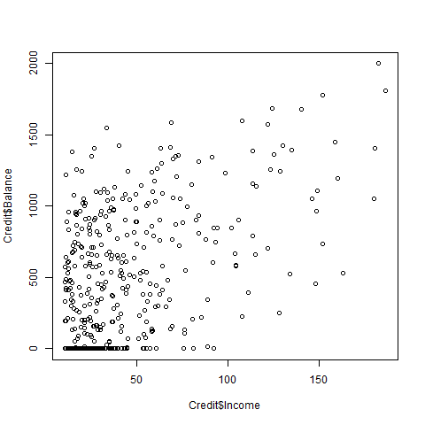

```{r pippo}

```

Questo è un testo che linka l'url [microsoft](https://www.microsft.com).<br>
Questo è in **bold**,<br>
Questa è una lista<br>
* primo elemento<br>
* secondo elemento<br>
<br>
Questo è *corsivo*.<br> 

Qui sotto un'immagine *bmp*:




```{r cor}
library(Credit)
X.1 <- Credit$Income
X.2 <- Credit$Age

cov(X.1,X.2)         # valore assoluto, non diviso per le sd delle due variabili;

cor(X.1,X.2)         # in genere più utile della covarianza, perchè confrontabile tra variabili;
                     # per default, il comando 'cor' usa il metodo di Pearson;
                     # la correlazione è semplicemente la covarianza standardizzata --> un numero tra -1 e 1,
                     # dove 0 --> non-correlazione, +1/-1 --> massima correlazione (l'intensità correlazione);
                     # |cor| > 0.5: interessante; |cor| > 0.7: alta (dipende dal dominio: nel "socio-demografico
                     # correlazioni in genere più basse; nei domini scientifici-ingegneristici correlazioni più alte,
                     # mondo finance: via di mezzo);
                     # correlazione positiva (>0) --> le due variabili crescono OPPURE diminuiscono INSIEME;
                     # correlazione negativa (<0) --> al crescere di una variabile, l'altra decresce, o viceversa;
                     # metodi di calcolo della correlazione (argomento 'method'): Pearson (default), Spearman (più "robusta"
                     # perchè usa le posizioni (ranking) anzichè i valori, ed in grado di misurare anche le relazioni non-lineari);
                     # la correlazione INDICA ASSOCIAZIONE tra le due variabili, NON CAUSA-EFFETTO!
                     # --> Vedi il libro "How to lie with statistics" di Darrell Huff (1954).
                     # la regressione si fa, poi, quando c'è causa-effetto! [Vicario].
                     # nella esplorazione dei dati la correlazione si misura su una COPPIA di variabili (numeriche). Nella
                     # regressione, che è una tecnica di previsione che vedremo nel prossimo corso, si misura anche la
                     # possibile correlazione tra molte variabili, che prende il nome di "multi-collinearità".

cor(X.1,X.2,method = "spearman")  # la correlazione calcolata in modo "robusto agli outlier", cioè con le posizioni anzichè i valori;
                                  # inoltre, individua anche relazioni non-lineari.

```
```{r}
x11()
plot(X.1,X.2,col="black")  # si chiama 'scatterplot'
X.1.jit <- jitter(X.1)     # "add a small amount of noise to a numeric vector." Evita (l'eventuale, non qui) overlap dei punti
X.2.jit <- jitter(X.2)
points(X.1.jit,X.2.jit,col="red") # 'points' stampa SOPRA un plot già aperto (altre funzioni così, es. 'lines')

# un grafico interattivo (vedi altri in seguito):
x11()                             # eseguire l'intero blocco di istruzioni - X11 toglie il focus all'editor!
                                  # x11 crea un nuove device grafico, dimensionabile con gli argomenti 'width' e 'height'
plot(X.1,X.2);identify(X.1,X.2)   # individuazione punti,
                                  # si esce dal plot con escape.
                                  # si ferma l'identificazione punti con il bottone 'stop'
dev.off()                         # chiude la finestra
```


```{r setup, include=FALSE}
knitr::opts_chunk$set(echo = TRUE)
```

## R Markdown

This is an R Markdown document. Markdown is a simple formatting syntax for authoring HTML, PDF, and MS Word documents. For more details on using R Markdown see <http://rmarkdown.rstudio.com>.

When you click the **Knit** button a document will be generated that includes both content as well as the output of any embedded R code chunks within the document. You can embed an R code chunk like this:

```{r test-gauss,results=FALSE}
set.seed(123)
x <- rnorm(50)

# Shapiro-Wilk test
# H₀ = normalità

shapiro.test(x)

# Jarque-Bera
# H₀ = normalità

# Installazione (se non lo hai già)
install.packages("tseries")
library(tseries)

# Dati con forte asimmetria (non normali)
y <- rexp(100)

# Jarque-Bera test
jarque.bera.test(y)
jarque.bera.test(x)
```


```{r}
library(ISLR)
shapiro.test(Credit$Balance)
hist(Credit$Balance)

shapiro.test(log(Credit$Balance))
hist(log(Credit$Balance))
```


## Including Plots

You can also embed plots, for example:

```{r pressure, echo=FALSE}
plot(pressure)
```

Note that the `echo = FALSE` parameter was added to the code chunk to prevent printing of the R code that generated the plot.
